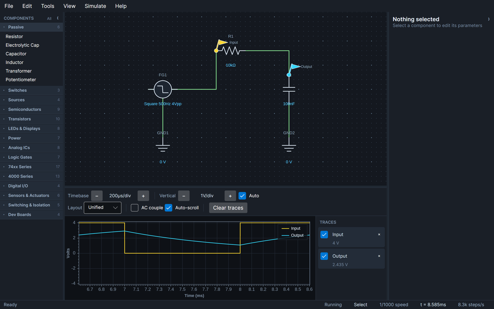

# CirqAvalonia

[](https://github.com/Harlock123/CIRQAvalonia/actions/workflows/release.yml)

An electronic circuit analyzer and mixed-signal simulator: a SPICE-style Modified Nodal Analysis
solver for the analog side, an event-driven scheduler for the digital side, and an Avalonia
schematic editor with a live oscilloscope on top.


**[Read the User Guide](docs/USER_GUIDE.md)** for how to drive the editor. What follows is how it
works underneath.

```
CirqAvalonia.slnx
├── src/
│   ├── Cirq.Core/         Domain model: components, terminals, nets, MNA stamping contract
│   ├── Cirq.Engine/       LU solver, Newton-Raphson, transient loop, digital event scheduler
│   ├── Cirq.Components/   Component library (RCL, transistors, diodes, thyristors, 741, 555, 74xx/4000, displays, boards)
│   └── Cirq.UI/           Avalonia editor, schematic canvas, inspector, ScottPlot scope
└── tests/
    ├── Cirq.Engine.Tests/      Solver accuracy against closed-form solutions
    ├── Cirq.Components.Tests/  Behavioural tests for every analog and logic device
    └── Cirq.UI.Tests/          View-model and controller integration
```

`Cirq.Core` holds the stamping contract (`MnaSystem`, `SimulationState`) so components can
describe themselves to the solver without depending on it. The dependency only ever runs
Core ← Engine ← Components ← UI, which keeps the whole engine headless-testable.

## Running

```bash
dotnet run --project src/Cirq.UI     # the editor
dotnet test                          # 729 tests
```

Targets .NET 10. The UI uses Avalonia 12 and ScottPlot 5.1; those two versions are pinned
together in `Directory.Packages.props` because they must agree on SkiaSharp (see the note there).

Prebuilt binaries for every supported platform are on the
[releases page](../../releases) — self-contained, so there is no runtime to install first.
Download, extract, run.

**On macOS, clear the quarantine flag first.** The builds are not signed or notarized, so macOS
refuses to launch them until the attribute the download put there is removed:

```bash
xattr -d com.apple.quarantine CirqAvalonia
./CirqAvalonia
```

Without it you get "cannot be opened" or "is damaged", which looks like a bad download rather than
a policy block. Right-clicking the binary in Finder and choosing **Open** works too. This is
required on Apple Silicon, not merely advisory — the only real fix is signing and notarization,
which needs an Apple developer account.

On Linux, mark it executable if your extractor dropped the bit: `chmod +x CirqAvalonia`.

## Building releases

```bash
./scripts/publish-all.sh              # all seven platforms, version 0.1.0
./scripts/publish-all.sh 1.2.0        # explicit version
./scripts/publish-all.sh 1.2.0 win-x64 linux-x64
```

Produces a self-contained single-file executable per platform in `dist/`, archived with the docs
and a `SHA256SUMS`. All seven cross-build from any one machine, because the runtime packs come from
NuGet.

`./scripts/verify-artifacts.sh` then checks that each archive really holds a binary for the
platform its name claims — a cross-build that targets the wrong architecture still exits 0 from
`dotnet publish`, so the only way to know is to look at the binary.

Releases are cut by [GitHub Actions](.github/workflows/release.yml), which runs the test suite,
builds all seven targets in parallel, verifies each one, and publishes them to a release:

```bash
git tag v0.2.0 && git push origin v0.2.0
```

Or run the workflow by hand from the Actions tab with a version. The workflow calls the same
scripts, so CI and a developer's machine cannot drift apart. A version with a pre-release suffix
(`0.2.0-beta.1`) is published as a prerelease, and re-running for an existing version replaces its
assets rather than failing.

Release notes come from [`CHANGELOG.md`](CHANGELOG.md): the section matching the version being
built is lifted into the release page above the download table, so **add the entry before
tagging** — the workflow reads the changelog at the tagged commit. A version with no entry warns
and publishes with the download table alone, rather than throwing away a build that passed over
missing prose.

```bash
./scripts/changelog-section.sh 0.2.0     # exactly what the release will carry
```

| Target | Platform |
| --- | --- |
| `win-x64` / `win-x86` / `win-arm64` | Windows, 64-bit / 32-bit / ARM |
| `osx-x64` / `osx-arm64` | macOS, Intel / Apple Silicon |
| `linux-x64` / `linux-arm64` | Linux, 64-bit / ARM |

Trimming is deliberately **off**. The properties inspector and the `.cirq` serializer both discover
component parameters by reflection, so a trimmer would strip properties nothing appears to
reference and break both at runtime rather than at build time — a silent failure is not worth the
saved megabytes. Single-file compression is on instead, which roughly halves the download.

ReadyToRun is also off, because it needs a cross-compiler matching the target architecture and that
would tie the script to whatever machine it runs on.

The macOS builds are neither signed nor notarized, so Gatekeeper quarantines them on download; each
macOS archive carries a `MACOS-FIRST-RUN.txt` with the one command that clears it.

## The engine

**Analog.** Each time point is stamped into a dense MNA system and solved by LU decomposition with
partial pivoting. Reactive elements use companion models discretised with the trapezoidal rule,
falling back to Backward Euler on the first step after a discontinuity to damp the transition.
Inductors and transformers are solved in branch-current form, so mutual inductance is just an
off-diagonal coefficient and a DC inductor is simply a short.

**Non-linear.** Diodes, transistors, op-amps and regulators are iterated with damped Newton-Raphson.
Bipolars use the Ebers-Moll transport model with an Early-effect output conductance; MOSFETs use the
level-1 square law with drain/source reversal and an intrinsic body diode. The diode
runs SPICE's `pnjlim` limiter and carries a real internal ohmic node, so the exponential is
linearised about the true junction voltage rather than the terminal voltage. The operating point
falls back to Gmin stepping when a circuit will not converge directly.


**Digital.** Logic devices are event-driven. Outputs are stamped as Thevenin sources at the logic
family's VOH/VOL, inputs are classified against VIH/VIL, and transitions are queued at
`t + tpd` in a timestamp-ordered priority queue. The transient loop truncates its step so a time
point lands exactly on the next queued transition or waveform edge, then resolves zero-delay
propagation as delta cycles before accepting the step. That is what lets a 555 timer's comparators,
latch and discharge transistor all interact with the RC network around them in one solve.


## Initial conditions

The t=0 state has two modes, and both actually solve the network:

- **Bias point** (default) settles the circuit as though it had been powered for ever: capacitors
  are open circuits, inductors are shorts.
- **Use initial conditions** pins each capacitor to its initial voltage and each inductor to its
  initial current (zero unless stated), so a source applied at t=0 is a genuine step.

Because the network is solved either way, an unsolvable topology — a voltage-source loop, a missing
ground — is reported when the circuit is compiled rather than silently producing zeros.

## Verification

Tests measure the solver against closed-form answers rather than recorded output:

| Area | What is checked |
| --- | --- |
| Transient accuracy | RC step response vs `V₀(1 − e^(−t/RC))`; trapezoidal error quarters when the step halves |
| Reactive elements | RL time constant, series RLC ringing frequency within 5% of `1/(2π√LC)` |
| Diode | Datasheet forward drop, ~100 mV/decade slope, zener breakdown, KCL consistency, convergence from 1 V to 100 V |
| LM741 | Closed-loop gain, virtual ground, rail saturation, open-loop gain, slew-rate limiting, −3 dB corner at GBW/gain |
| NE555 | Astable frequency vs `1.44/((R1+2R2)C)` across four R/C combinations, duty cycle, supply independence |
| 74xx | Truth tables end-to-end through the analog domain, 7474/7476 edge triggering and async clear, 7490 BCD sequence, 74138 one-hot decode, 74151 addressing, shift register load and clock inhibit |
| LM339 | Per-channel comparison, wired-AND when outputs are tied, release when unpowered |
| Regulators | Line and load regulation, dropout, current limiting, LM317 divider programming |
| BJT | Beta in forward active, saturation, cutoff, exponential Vbe, PNP mirroring, KCL at all three terminals |
| MOSFET | Square-law saturation current, triode switching, zero gate current, reverse conduction, body diode |
| JFET | Full I_DSS at zero gate drive, square law across the range, pinch-off, vanishing gate current, P-channel mirroring |
| Thyristors | SCR blocking and firing, staying on after the gate drive goes away, dropping out when the anode current is interrupted, reverse blocking; triac firing on both half cycles and turning itself off at every zero crossing; diac breakover in either polarity |
| 4000 series | 4017 one-hot walk, reset, carry dividing by ten; 4511 glyph table, active-high drive, lamp test and blanking priority; 4066 analog pass-through and its on-resistance dividing with the load |
| Comparator | Open-collector pull-down and release, driving a higher rail through a pull-up, edge timing |
| Displays | 7447 glyph table, open-collector drive, lamp test and blanking priority, counter walking 0-9 on the display |
| Files | Every component type round-trips with its parameters, pins, wires, waypoints and probes; a reloaded circuit solves to the same answer; damaged, unknown and newer-format files are handled without losing the open circuit |
| Settings | Theme round-trips across a restart, corrupt and newer-format preference files fall back to defaults, opening the dialog writes nothing, choosing a theme saves immediately |
| UI | Background transport, probe decimation, reflection-built inspector, dirty tracking, every example compiles, runs, saves and reopens |

## Development boards

Raspberry Pi and Arduino boards sit on the schematic as ordinary logic devices, either sourcing
signals or reading them. Electrically a board is a pin map plus a per-pin mode, and the existing
machinery covers all of it: `LogicState.HighImpedance` — built for the 7447's open-collector
outputs — is exactly a GPIO configured as an input, which is what lets a pin change direction
without changing the size of the matrix, so retyping the setup never recompiles the netlist.

A board's pins are configured with one line, because a forty-pin header as forty inspector rows
would be unreadable and most circuits use three pins:

```
GPIO17=high; GPIO18=clock@1kHz; GPIO22=in-pullup; GPIO12=pwm@500Hz:25%
GPIO23=seq@1kHz:1101_0010; GPIO24=once@1kHz:001
```

`seq` loops a bit pattern and `once` plays it through and holds the last step, which is what makes
a one-shot usable as a reset pulse rather than something that yanks the line back down every few
milliseconds. A `z` step releases the pin for that step, so an open-drain line or a shared bus
handed over mid-pattern both fall out of the same mechanism.

Boards are then checked against their datasheet limits as the simulation runs — a Pi GPIO above
3.3V (it is not 5V tolerant), a pin over its current rating, the total GPIO budget — and a
violation is reported in the status bar. These are deliberately kept separate from solver errors:
the circuit solves perfectly well, it is the hardware that would not survive it.

The [User Guide](docs/USER_GUIDE.md#development-boards) has the full pin-mode reference.

## Saving circuits

Circuits are saved as `.cirq` files — plain, indented JSON, so a schematic is readable and diffs
sensibly in version control.

Components are persisted by type name plus the parameters
`ComponentReflection.EditableProperties` reports — the *same* rule the properties inspector uses to
decide what you can edit. That is deliberate: if a value can be edited it is saved, and if it is
saved it can be edited. A new component type is therefore saveable the moment it exists, with no
registry to forget to update.

Wires and probes refer to terminals as (component id, pin id) rather than by object identity, so
they reattach to exactly the right pins on reload. Device models are stored by name and resolved
against their library. A gate's input count is carried separately, because it shapes the pins and
so cannot simply be assigned after construction.

Loading is deliberately forgiving: an unknown component type, a wire whose endpoint has gone, or a
model this build no longer ships are each reported as warnings while the rest of the circuit still
opens. Only a malformed file, or one written by a newer format version, is refused outright. Saves
go to a temporary file and are moved into place, so an interrupted write cannot destroy the
original.

## Theme and settings

`File > Settings` opens a preferences dialog offering **System**, **Light**, **Dark** and
**High contrast**. System comes first and follows the desktop's light/dark setting, tracking it if
it changes while the application is running; the others pin a palette. When System is selected the
dialog says what the desktop is currently reporting, or admits that it cannot tell — on a bare
window manager there may be no portal to ask, and silently falling back to dark would otherwise
look like the setting had been ignored.


The same circuit in the light and high contrast palettes:


Preferences are stored as JSON under the user's config directory (`~/.config/CirqAvalonia/` on
Linux) and survive a restart. Changes apply and save immediately, so there is no OK/Cancel to get
wrong. A damaged or unreadable file falls back to defaults rather than preventing startup.

Colours come from one semantic palette in `Views/Themes.axaml` — `PanelBackground`,
`SymbolStroke`, `WireStroke` and so on — defined once per theme variant. The canvas and the scope
are drawn in code rather than declared in XAML, so they resolve those same keys at runtime through
`ThemeManager` instead of carrying a second palette that would silently drift. Adding a theme means
adding one more `ResourceDictionary` and one more entry to the selector.

High contrast is a *custom* `ThemeVariant` rather than one of Avalonia's two built-ins, so its
dictionary is keyed with `x:Static` — the XAML type converter only understands `Light` and `Dark`
and throws on anything else. It inherits from Dark, which means the Fluent control chrome the
palette does not name still resolves instead of coming back empty. Tests assert that all three
variants define exactly the same key set, and that every canvas element clears a minimum contrast
ratio against the canvas it is drawn on — a missing key would otherwise render magenta at runtime
rather than failing a build.

## Using the editor

Commands live in the menu bar — **File, Edit, Tools, View, Simulate, Help** — rather than on a
toolbar. Three wrapped rows of buttons cost more vertical space than the canvas could spare in a
narrow window; one menu row gives about 140 px back. The status bar carries the readouts the
toolbar used to show: active tool, simulation speed, elapsed time and solver rate.

`Help > Keyboard Shortcuts` lists everything below, and the
[User Guide](docs/USER_GUIDE.md) walks through building a circuit from an empty canvas.

The palette holds 101 components in 14 collapsible categories:



Selecting a component fills the properties panel. It is built by reflection, so a new component
type gets a complete editor without any UI code:


Probes attach to terminals and stream into the scope, which redraws on its own timer so the render
rate is decoupled from the solver:


| | |
| --- | --- |
| Place | Click a palette entry, then click the canvas |
| Wire | `W`, click a terminal, click empty space for corners, click a terminal to finish |
| Probe | `P`, then click a terminal |
| Select | `V` — drag to move, `R` to rotate, `Delete` to remove |
| View | Wheel zooms at the cursor, middle-drag or space-drag pans, `F` fits |
| Scope | The vertical range follows the traces by default, so changing a source amplitude keeps the waveform on screen. The `Auto` checkbox turns that off, and using the vertical `+`/`-` buttons turns it off for you |
| File | `Ctrl+N` new, `Ctrl+O` open, `Ctrl+S` save, `Ctrl+Shift+S` save as, and `File > Settings` for the theme. The title bar shows the document and an asterisk while there are unsaved edits |
| Transport | `F5` run/pause, `F6` single step, `F8` reset |
| Interactive | Switches, buttons, logic toggles, LDRs and thermistors are operated by double-clicking them. They are ringed with a small dot so you can tell which parts those are; **View > Mark Interactive Parts** turns the rings off |
| Panels | `F9` collapses the palette to the left, `F10` the properties panel to the right — or click the chevron in either panel's header. A collapsed panel leaves a labelled rail at the edge; click it to bring the panel back. Palette groups also collapse individually (`All` toggles every group) |

The toolbar wraps onto extra rows rather than overflowing, and `MinWidth` is deliberately small, so
the window stays usable at whatever size a tiling window manager hands it.

Component values accept engineering notation: `10k`, `2.2M`, `100R`, `4k7`, `100nF`, `1kHz`.

Switches, push buttons and logic toggles are operated by **double-clicking them on the canvas**
rather than through the inspector.

The properties inspector is built by reflecting over each component's public settable properties,
so a new component type gets a complete editor without any UI code.
