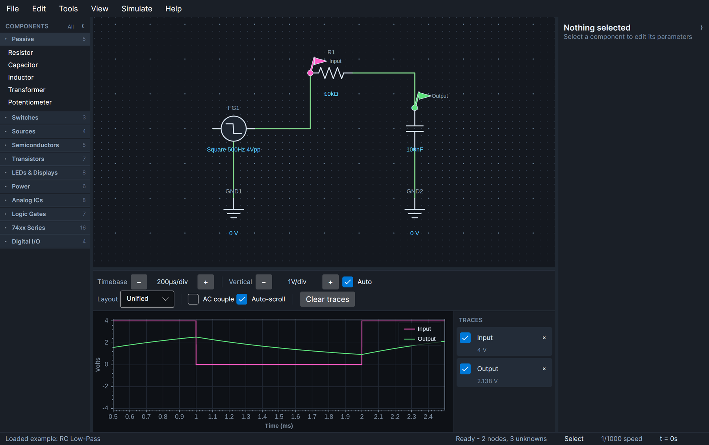
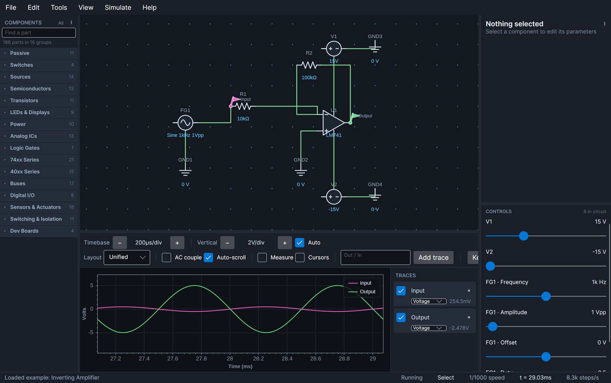
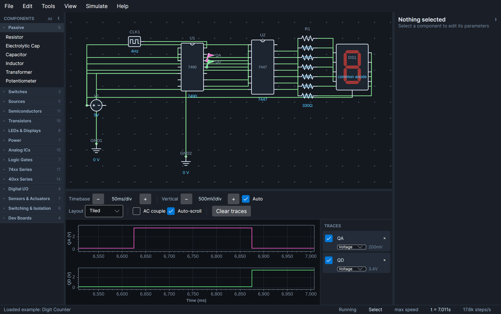
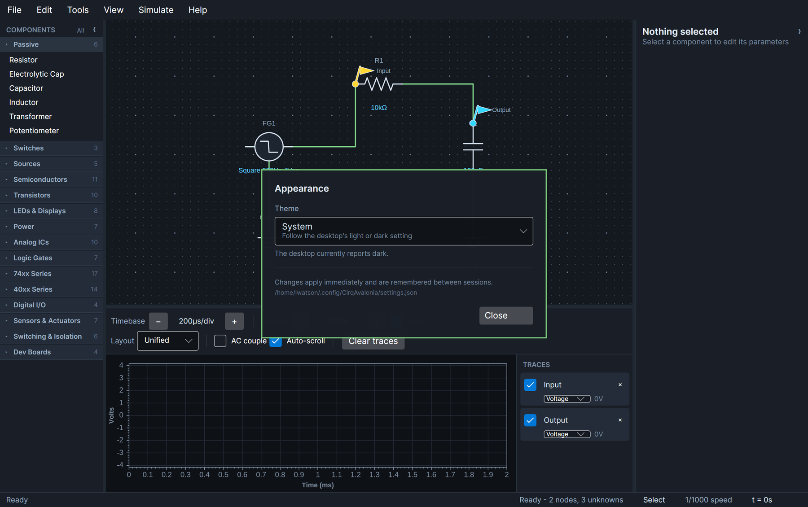
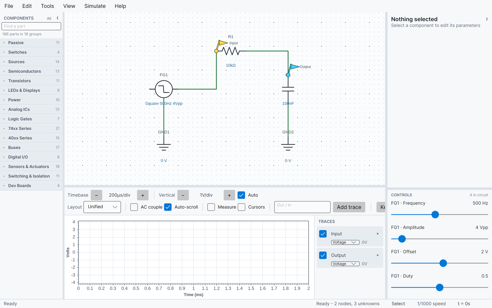
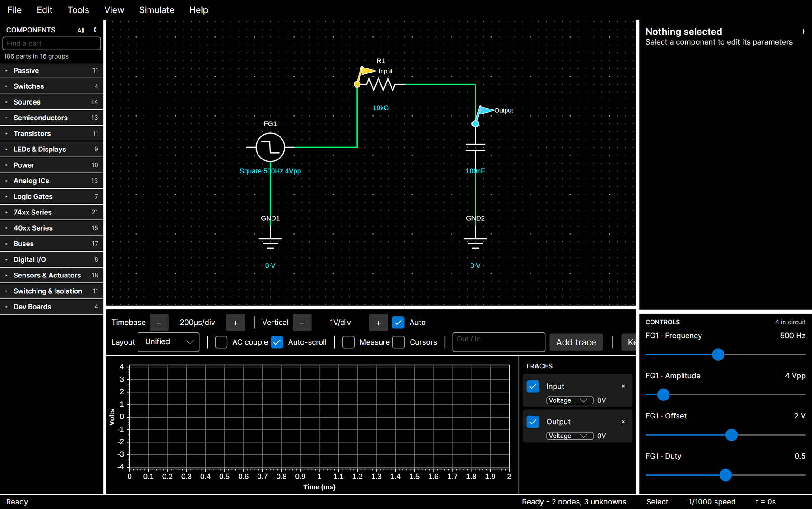
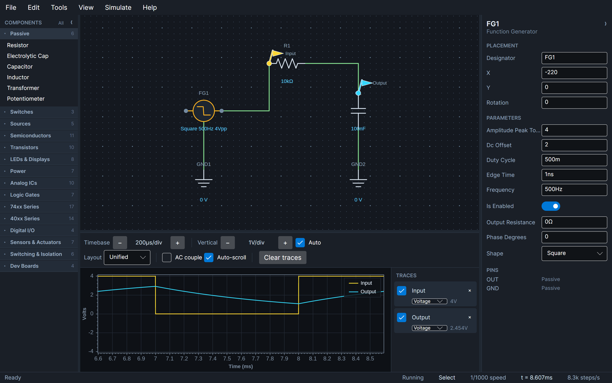
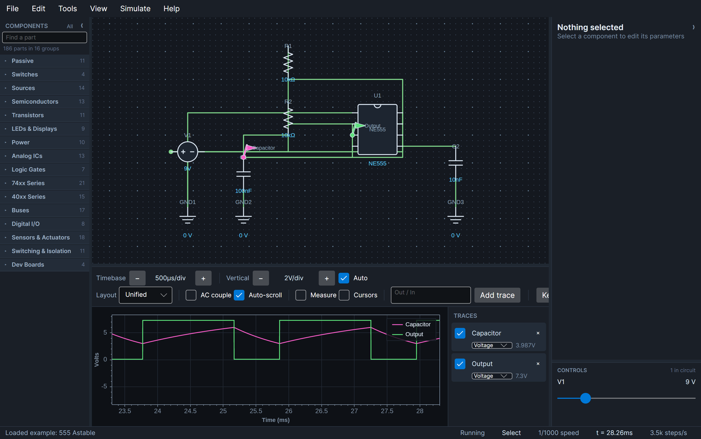
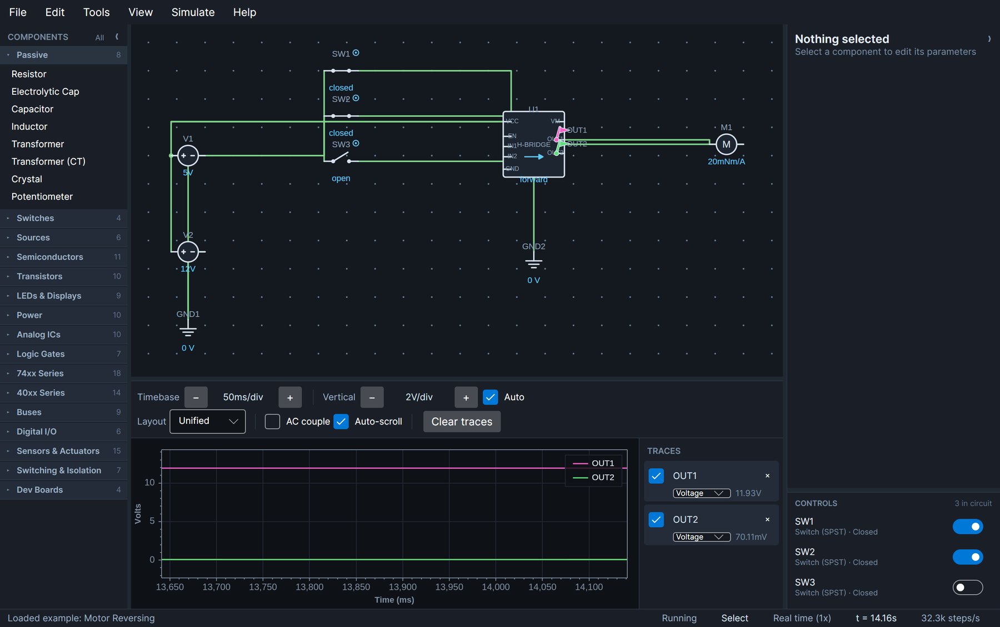
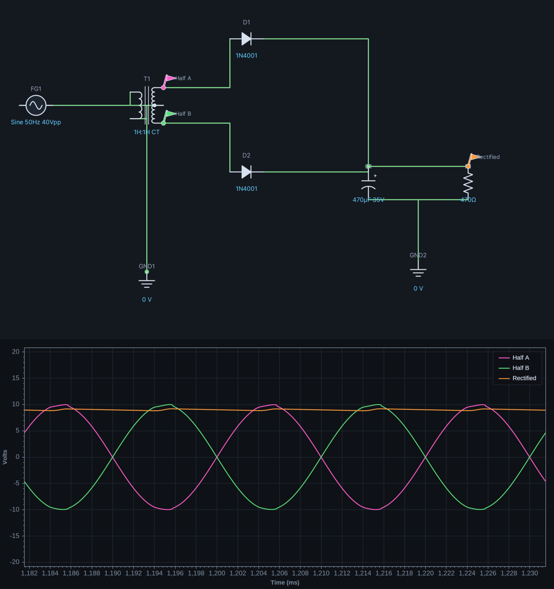

# CirqAvalonia

[](https://github.com/Harlock123/CIRQAvalonia/actions/workflows/release.yml)

An electronic circuit analyzer and mixed-signal simulator: a SPICE-style Modified Nodal Analysis
solver for the analog side, an event-driven scheduler for the digital side, and an Avalonia
schematic editor with a live oscilloscope on top.



**[Read the User Guide](docs/USER_GUIDE.md)** for how to drive the editor. What follows is how it
works underneath.

```
CirqAvalonia.slnx
├── src/
│   ├── Cirq.Core/         Domain model: components, terminals, nets, MNA stamping contract
│   ├── Cirq.Engine/       LU solver, Newton-Raphson, transient loop, digital event scheduler
│   ├── Cirq.Components/   Component library (RCL, transistors, diodes, thyristors, 741, 555, 74xx/4000, displays, boards)
│   └── Cirq.UI/           Avalonia editor, schematic canvas, inspector, ScottPlot scope
└── tests/
    ├── Cirq.Engine.Tests/      Solver accuracy against closed-form solutions
    ├── Cirq.Components.Tests/  Behavioural tests for every analog and logic device
    └── Cirq.UI.Tests/          View-model and controller integration
```

`Cirq.Core` holds the stamping contract (`MnaSystem`, `SimulationState`) so components can
describe themselves to the solver without depending on it. The dependency only ever runs
Core ← Engine ← Components ← UI, which keeps the whole engine headless-testable.

## Running

```bash
dotnet run --project src/Cirq.UI     # the editor
dotnet test                          # 1587 tests
```

Targets .NET 10. The UI uses Avalonia 12 and ScottPlot 5.1; those two versions are pinned
together in `Directory.Packages.props` because they must agree on SkiaSharp (see the note there).

Prebuilt binaries for every supported platform are on the
[releases page](../../releases) — self-contained, so there is no runtime to install first.
Download, extract, run.

**On macOS the build is not signed or notarized**, so Gatekeeper blocks the first launch. You get
"cannot be opened" or "is damaged", which reads like a bad download rather than a policy decision.
Either route below clears it, permanently — you only do this once per download.

**Without a terminal:**

1. Double-click `CirqAvalonia`. macOS refuses, offering only **Done** or **Move to Bin**. Choose
   Done — the refusal is the step that arms the next one.
2. Open **System Settings → Privacy & Security** and scroll to **Security**. An **Open Anyway**
   button is now there, naming the app.
3. Click it, authenticate, and launch the app again.

If there is no button, launch the app once more first: it only appears after a blocked attempt, and
it lapses after about an hour.

**Or from a terminal:**

```bash
xattr -d com.apple.quarantine CirqAvalonia
./CirqAvalonia
```

Right-clicking in Finder and choosing **Open** used to work as well, and still does through
macOS 14. Apple removed that bypass in macOS 15 (Sequoia), which is why the Settings route is the
one written out above.

This is required on Apple Silicon, not merely advisory. The only real fix is signing and
notarization, which needs a paid Apple developer account.

**Signing is the intention, just not yet.** Leaving it unsigned is a decision rather than an
oversight. Notarization is per build, not per project: every archive of every release has to go to
Apple, come back, and be stapled individually. So the cost is not one afternoon of setup — it is a
step welded onto every release, and releases here currently land within hours of each other. Apple
is not quick at its end either. Until the pace settles down, the one-time click above is the better
trade for everyone. The plan has not changed — a Developer ID certificate, hardened runtime and a
notarized `.app` bundle — and when it happens this whole section goes away.

On Linux, mark it executable if your extractor dropped the bit: `chmod +x CirqAvalonia`.

## Building releases

```bash
./scripts/publish-all.sh              # all seven platforms, version 0.1.0
./scripts/publish-all.sh 1.2.0        # explicit version
./scripts/publish-all.sh 1.2.0 win-x64 linux-x64
```

Produces a self-contained single-file executable per platform in `dist/`, archived with the docs
and a `SHA256SUMS`. All seven cross-build from any one machine, because the runtime packs come from
NuGet.

`./scripts/verify-artifacts.sh` then checks that each archive really holds a binary for the
platform its name claims — a cross-build that targets the wrong architecture still exits 0 from
`dotnet publish`, so the only way to know is to look at the binary.

Releases are cut by [GitHub Actions](.github/workflows/release.yml), which runs the test suite,
builds all seven targets in parallel, verifies each one, and publishes them to a release:

```bash
git tag v0.2.0 && git push origin v0.2.0
```

Or run the workflow by hand from the Actions tab with a version. The workflow calls the same
scripts, so CI and a developer's machine cannot drift apart. A version with a pre-release suffix
(`0.2.0-beta.1`) is published as a prerelease, and re-running for an existing version replaces its
assets rather than failing.

Release notes come from [`CHANGELOG.md`](CHANGELOG.md): the section matching the version being
built is lifted into the release page above the download table, so **add the entry before
tagging** — the workflow reads the changelog at the tagged commit. A version with no entry warns
and publishes with the download table alone, rather than throwing away a build that passed over
missing prose.

```bash
./scripts/changelog-section.sh 0.2.0     # exactly what the release will carry
```

| Target | Platform |
| --- | --- |
| `win-x64` / `win-x86` / `win-arm64` | Windows, 64-bit / 32-bit / ARM |
| `osx-x64` / `osx-arm64` | macOS, Intel / Apple Silicon |
| `linux-x64` / `linux-arm64` | Linux, 64-bit / ARM |

Trimming is deliberately **off**. The properties inspector and the `.cirq` serializer both discover
component parameters by reflection, so a trimmer would strip properties nothing appears to
reference and break both at runtime rather than at build time — a silent failure is not worth the
saved megabytes. Single-file compression is on instead, which roughly halves the download.

ReadyToRun is also off, because it needs a cross-compiler matching the target architecture and that
would tie the script to whatever machine it runs on.

The macOS builds are neither signed nor notarized, so Gatekeeper quarantines them on download; each
macOS archive carries a `MACOS-FIRST-RUN.txt` with the one command that clears it.

## The engine

**Analog.** Each time point is stamped into a dense MNA system and solved by LU decomposition with
partial pivoting. Reactive elements use companion models discretised with the trapezoidal rule,
falling back to Backward Euler on the first step after a discontinuity to damp the transition.
Inductors and transformers are solved in branch-current form, so mutual inductance is just an
off-diagonal coefficient and a DC inductor is simply a short.

**Non-linear.** Diodes, transistors, op-amps and regulators are iterated with damped Newton-Raphson.
Bipolars use the Ebers-Moll transport model with an Early-effect output conductance; MOSFETs use the
level-1 square law with drain/source reversal and an intrinsic body diode. The diode
runs SPICE's `pnjlim` limiter and carries a real internal ohmic node, so the exponential is
linearised about the true junction voltage rather than the terminal voltage. The operating point
falls back to Gmin stepping when a circuit will not converge directly.



**Digital.** Logic devices are event-driven. Outputs are stamped as Thevenin sources at the logic
family's VOH/VOL, inputs are classified against VIH/VIL, and transitions are queued at
`t + tpd` in a timestamp-ordered priority queue. The transient loop truncates its step so a time
point lands exactly on the next queued transition or waveform edge, then resolves zero-delay
propagation as delta cycles before accepting the step. That is what lets a 555 timer's comparators,
latch and discharge transistor all interact with the RC network around them in one solve.



## Initial conditions

The t=0 state has two modes, and both actually solve the network:

- **Bias point** (default) settles the circuit as though it had been powered for ever: capacitors
  are open circuits, inductors are shorts.
- **Use initial conditions** pins each capacitor to its initial voltage and each inductor to its
  initial current (zero unless stated), so a source applied at t=0 is a genuine step.

Because the network is solved either way, an unsolvable topology — a voltage-source loop, a missing
ground — is reported when the circuit is compiled rather than silently producing zeros.

## Verification

Tests measure the solver against closed-form answers rather than recorded output:

| Area | What is checked |
| --- | --- |
| Transient accuracy | RC step response vs `V₀(1 − e^(−t/RC))`; trapezoidal error quarters when the step halves |
| Reactive elements | RL time constant, series RLC ringing frequency within 5% of `1/(2π√LC)` |
| Diode | Datasheet forward drop, ~100 mV/decade slope, zener breakdown, KCL consistency, convergence from 1 V to 100 V |
| LM741 | Closed-loop gain, virtual ground, rail saturation, open-loop gain, slew-rate limiting, −3 dB corner at GBW/gain |
| NE555 | Astable frequency vs `1.44/((R1+2R2)C)` across four R/C combinations, duty cycle, supply independence |
| 74xx | Truth tables end-to-end through the analog domain, 7474/7476 edge triggering and async clear, 7490 BCD sequence, 74138 one-hot decode, 74151 addressing, shift register load and clock inhibit |
| LM339 | Per-channel comparison, wired-AND when outputs are tied, release when unpowered |
| Regulators | Line and load regulation, dropout, current limiting, LM317 divider programming |
| BJT | Beta in forward active, saturation, cutoff, exponential Vbe, PNP mirroring, KCL at all three terminals |
| MOSFET | Square-law saturation current, triode switching, zero gate current, reverse conduction, body diode |
| JFET | Full I_DSS at zero gate drive, square law across the range, pinch-off, vanishing gate current, P-channel mirroring |
| Thyristors | SCR blocking and firing, staying on after the gate drive goes away, dropping out when the anode current is interrupted, reverse blocking; triac firing on both half cycles and turning itself off at every zero crossing; diac breakover in either polarity |
| Noise | The RMS coming out being the RMS asked for and centred on zero, the same seed giving the same noise and a different one giving different, a sample held for its whole interval rather than redrawn every time point, and the amplitude scaling as asked |
| Hysteresis | A clean ramp crossing a comparator's threshold once, the same ramp with noise on it chattering, and a feedback resistor putting it back to one — which is what the LM311, LM393 and 74HC14 are for |
| Output swing | A rail-to-rail part reaching within a whisker of both supplies, an LM358 reaching the bottom one but not the top, an LM741 reaching neither, all three agreeing halfway up, and a 741 unable to put out one volt on a single five volt supply. Plus a matrix of every headroom pair against every supply arrangement, since a symmetric part on a split supply hides the cases that matter |
| Live controls | Building the panel changing nothing and raising no change events, working a control moving its component and reporting it, the panel following a part worked from the canvas without reporting that as an edit, a range becoming a slider and a six-decade one becoming a logarithmic slider, a whole-number property being written a whole number, and the panel following parts placed and removed |
| H-bridge | Driving forward and reverse with the current reversing too, both inputs the same braking with nothing across the motor, disabling coasting rather than braking, the interlock stopping shoot-through and its absence making a short across the supply, unwired inputs reading low, and the body diodes clamping an inductive kick |
| Transmission line | A matched source seeing half its voltage until the far end answers, an open end doubling the wave and a short inverting it, a matched load absorbing it completely, a stiff driver into an unterminated line giving a staircase, and a series resistor at the source stopping the ringing — every figure from the textbook reflection coefficient rather than from a previous run |
| 1-Wire | A presence pulse answering a reset, a temperature arriving over a single wire as pulse widths, 85 °C coming back when the conversion was skipped or cut short, a function command without a ROM command being ignored, resolution trading precision for conversion time, the Dallas CRC against a known scratchpad, parasitic power browning out on an ordinary pull-up and working on a strong one, and a hundred metres of cable returning rubbish where two metres does not |
| I2C DAC | Code over full scale times the supply, full scale following the supply because there is no reference, a load pulling the output down and an op-amp follower restoring it, both write forms and their different bit alignments, only the EEPROM write surviving a power cycle, and the ADC beside it reading back what the DAC put out |
| Ferrite bead | A wire at DC, the datasheet impedance being true only at the datasheet frequency, falling away above its band, reactance dominating below the band and resistance inside it — and the consequence: it rings exactly like an inductor against a large capacitor and damps only where the ringing is in its band |
| Gate driver | Switching a gate orders of magnitude faster than a logic pin, moving the gate charge in charge over current, taking the gate to its own supply rather than the logic rail, a logic pin unable to reach the gate voltage at all, sinking harder than it sources, and refusing to drive below its lockout voltage |
| Reed switch | A magnet of either pole closing it with no supply at all, holding between the two thresholds, a burst of edges on closing that a Hall switch does not produce, and opening cleanly because there is nothing to rebound off |
| PIR sensor | Ignoring everything while it warms up, triggering on movement and holding long after it stops, retriggerable restarting the hold where single-shot gives up, and driving both ways rather than needing a pull-up |
| Li-ion charger | Constant current well below full, the current tapering as the cell approaches its float voltage and stopping at it, no headroom meaning no charge, the dissipation being exactly what the input does not put in the cell, and termination latching rather than cycling |
| I2C ADC | A voltage on a node read back over two wires as the same number, the gain setting pinning at full scale rather than complaining and pushing further past it changing nothing, a wider range fitting what the narrow one clipped, reading faster than it converts returning the previous answer, differential measuring the difference, and the configuration register written and read back |
| Hall sensor | A field strong enough pulling the output down, the pull-up having it otherwise, hysteresis holding the same field either way depending on which way it was approached, the wrong pole ignored by a unipolar part and answered by an omnipolar one, and a missing pull-up reported rather than silently useless |
| Phototransistor | Current following the light and doubling when it doubles, too large a load saturating it in ordinary light, and a dark current rather than nothing |
| UART | A character crossing the wire and a whole string in order, the far end echoing back, a two-percent clock error tolerated and a doubled or halved one reading definite wrong bytes — more than were sent when counting fast, fewer when counting slow — with framing errors where the stop bit missed; the same wrong bytes every run; TX wired to TX moving nothing; a receive line held low being a break rather than a byte; parity agreed and disagreed |
| Level shifter | Each side resting at its own rail, the low side pulled down taking the high side with it and the high side pulled down taking the low side back through the body diode, channels independent, and each missing or reversed rail reported |
| I2C | A byte written over two wires and found in the device, multi-byte writes and read-back, an unanswered address going unacknowledged, two devices sharing one bus, a port expander's byte reaching eight pins, and a bus with no pull-ups doing nothing at all |
| SPI | A byte clocked into a 74595 and onto its outputs, most significant bit first, the latch holding the outputs still while the bits walk through, and output enable releasing rather than driving |
| Character LCD | Latching on E falling and not before, the command table, four-bit nibble pairing, an unpaired nibble doing nothing, and line two being an address rather than a continuation |
| Solar cell | Open-circuit voltage per cell, short-circuit current, light setting the current while barely moving the voltage — against `n·kT/q·ln(2)` — the knee, and a maximum power point that is neither extreme |
| Switching regulator | Stepping 12 V down to 5 V, the divider setting the output at three ratios, the same chip rewired stepping 5 V up to 12 V, the timing capacitor setting the frequency, a lighter load using less of the time, and the current limit tripping when the sense resistor is too large |
| Thermocouple | Microvolts per degree for each alloy pair, measuring a difference rather than a temperature, and an INA126 turning two millivolts into something readable |
| Load cell | Rated output in millivolts per volt, proportional to load and to excitation both, and saying nothing at all when the bridge is not excited |
| Rotary encoder | Two staggered pulses per detent, which contact moves first carrying the direction, and contacts that bounce on every edge unless told not to |
| Charge pump | A negative rail from a positive one, following the input because nothing regulates, and sagging when the pump capacitor is too small for the load |
| Centre-tapped transformer | The two halves swinging opposite ways about the tap, a full-wave output rippling at twice the line frequency, and one diode drop in the path rather than a bridge's two |
| Inductor saturation | Ideal while the saturation current is left at zero, inductance halved at the stated current, and the current running away past the knee |
| DS1307 | BCD encoding both ways, the time read back off the bus from the datasheet's registers, the clock advancing on its own between two reads, and the clock-halt bit stopping it |
| HC-SR04 | 58 µs of echo per centimetre at three distances, silence until it is triggered, a trigger under ten microseconds ignored, and a 38 ms pulse rather than none when nothing is in range |
| Crystal | Resonating within 0.1% of its rated frequency from the motional L and C alone, a motional inductance in henries, and a far larger response on resonance than beside it |
| Microphone | Biasing part way down the rail, sound swinging the output and silence not, and being starved by too large a bias resistor |
| Servo | Pulse width setting the angle at both ends of travel and the centre, taking time to travel there, going limp when the pulses stop, and reporting a pulse that drives it into its end stop |
| Stepper | Turning with the coil order and back with it reversed, two adjacent coils holding it half way between, the first energisation aligning rather than stepping, and losing steps when driven faster than it can follow |
| Current probes | Ohm's law through a resistor, equal and opposite at the two ends, a capacitor's charging current against `C dv/dt`, a transistor's three terminals summing to zero, a switch carrying nothing when open |
| Battery | Sag against the internal resistance, a coin cell sagging where a lead-acid does not, coulomb counting against the rating, a discharge curve that is flat and then is not |
| Surge parts | A TVS invisible below its standoff and clamping either polarity above it; a varistor's power law, and wearing out on the energy it absorbs |
| ULN2003 | Sinking the load current, the Darlington's saturation voltage, a released channel passing nothing, and a load wired to ground doing nothing at all |
| Amplifiers | LM386 idling at half supply, its stated gain, clipping at the rails; INA126 rejecting four volts of common mode; the speaker's average power |
| 40xx series | Gate truth tables on the CMOS pinout, and that it is *not* the 74xx one; 4093 hysteresis and its relaxation-oscillator period against the closed form; 4013 toggling and its active-high set and reset; 4040 stage-by-stage division and falling-edge clocking; 4017 one-hot walk, reset and carry; 4511 glyph table, active-high drive, lamp test and blanking priority; 4066 and 4051 analog pass-through, switch resistance and off-state leakage; 4060 oscillating from its own Rt and Ct at the datasheet's 1/(2.3·Rt·Ct), and the frequency tracking a changed capacitor |
| Comparator | Open-collector pull-down and release, driving a higher rail through a pull-up, edge timing |
| Displays | 7447 glyph table, open-collector drive, lamp test and blanking priority, counter walking 0-9 on the display |
| About | Every library reporting a version that matches the assembly actually loaded, an unstamped build saying so rather than claiming 1.0.0, the palette counts being counted, and the copied text carrying everything a bug report needs |
| Parts list | Identical parts collapsing to one line with a count, the value separating otherwise identical parts, grounds left out, R10 sorting after R2, and the table reaching the file rather than merely being given room |
| Export | Every format writes a file worth opening; a PNG at the size of the circuit and a raster scale that only multiplies pixels; a hand-written BMP header that agrees with its own pixel count; an SVG made of shapes rather than an embedded image; a PDF that starts and ends as one, with two pages when the traces get their own; framing that follows the circuit rather than the view; and a scope that clears the canvas being unable to wipe the schematic above it |
| Files | Every component type round-trips with its parameters, pins, wires, waypoints and probes; a reloaded circuit solves to the same answer; damaged, unknown and newer-format files are handled without losing the open circuit |
| Settings | Theme round-trips across a restart, corrupt and newer-format preference files fall back to defaults, opening the dialog writes nothing, choosing a theme saves immediately |
| UI | Background transport, probe decimation, reflection-built inspector, dirty tracking, every example compiles, runs, saves and reopens |

## Development boards

Raspberry Pi and Arduino boards sit on the schematic as ordinary logic devices, either sourcing
signals or reading them. Electrically a board is a pin map plus a per-pin mode, and the existing
machinery covers all of it: `LogicState.HighImpedance` — built for the 7447's open-collector
outputs — is exactly a GPIO configured as an input, which is what lets a pin change direction
without changing the size of the matrix, so retyping the setup never recompiles the netlist.

A board's pins are configured with one line, because a forty-pin header as forty inspector rows
would be unreadable and most circuits use three pins:

```
GPIO17=high; GPIO18=clock@1kHz; GPIO22=in-pullup; GPIO12=pwm@500Hz:25%
GPIO23=seq@1kHz:1101_0010; GPIO24=once@1kHz:001
```

`seq` loops a bit pattern and `once` plays it through and holds the last step, which is what makes
a one-shot usable as a reset pulse rather than something that yanks the line back down every few
milliseconds. A `z` step releases the pin for that step, so an open-drain line or a shared bus
handed over mid-pattern both fall out of the same mechanism.

Boards are then checked against their datasheet limits as the simulation runs — a Pi GPIO above
3.3V (it is not 5V tolerant), a pin over its current rating, the total GPIO budget — and a
violation is reported in the status bar. These are deliberately kept separate from solver errors:
the circuit solves perfectly well, it is the hardware that would not survive it.

The [User Guide](docs/USER_GUIDE.md#development-boards) has the full pin-mode reference.

## Saving circuits

Circuits are saved as `.cirq` files — plain, indented JSON, so a schematic is readable and diffs
sensibly in version control.

Components are persisted by type name plus the parameters
`ComponentReflection.EditableProperties` reports — the *same* rule the properties inspector uses to
decide what you can edit. That is deliberate: if a value can be edited it is saved, and if it is
saved it can be edited. A new component type is therefore saveable the moment it exists, with no
registry to forget to update.

Wires and probes refer to terminals as (component id, pin id) rather than by object identity, so
they reattach to exactly the right pins on reload. Device models are stored by name and resolved
against their library. A gate's input count is carried separately, because it shapes the pins and
so cannot simply be assigned after construction.

Loading is deliberately forgiving: an unknown component type, a wire whose endpoint has gone, or a
model this build no longer ships are each reported as warnings while the rest of the circuit still
opens. Only a malformed file, or one written by a newer format version, is refused outright. Saves
go to a temporary file and are moved into place, so an interrupted write cannot destroy the
original.

## Theme and settings

`File > Settings` opens a preferences dialog offering **System**, **Light**, **Dark** and
**High contrast**. System comes first and follows the desktop's light/dark setting, tracking it if
it changes while the application is running; the others pin a palette. When System is selected the
dialog says what the desktop is currently reporting, or admits that it cannot tell — on a bare
window manager there may be no portal to ask, and silently falling back to dark would otherwise
look like the setting had been ignored.



The same circuit in the light and high contrast palettes:





Preferences are stored as JSON under the user's config directory (`~/.config/CirqAvalonia/` on
Linux) and survive a restart. Changes apply and save immediately, so there is no OK/Cancel to get
wrong. A damaged or unreadable file falls back to defaults rather than preventing startup.

Colours come from one semantic palette in `Views/Themes.axaml` — `PanelBackground`,
`SymbolStroke`, `WireStroke` and so on — defined once per theme variant. The canvas and the scope
are drawn in code rather than declared in XAML, so they resolve those same keys at runtime through
`ThemeManager` instead of carrying a second palette that would silently drift. Adding a theme means
adding one more `ResourceDictionary` and one more entry to the selector.

High contrast is a *custom* `ThemeVariant` rather than one of Avalonia's two built-ins, so its
dictionary is keyed with `x:Static` — the XAML type converter only understands `Light` and `Dark`
and throws on anything else. It inherits from Dark, which means the Fluent control chrome the
palette does not name still resolves instead of coming back empty. Tests assert that all three
variants define exactly the same key set, and that every canvas element clears a minimum contrast
ratio against the canvas it is drawn on — a missing key would otherwise render magenta at runtime
rather than failing a build.

## Using the editor

Commands live in the menu bar — **File, Edit, Tools, View, Simulate, Help** — rather than on a
toolbar. Three wrapped rows of buttons cost more vertical space than the canvas could spare in a
narrow window; one menu row gives about 140 px back. The status bar carries the readouts the
toolbar used to show: active tool, simulation speed, elapsed time and solver rate.

`Help > Keyboard Shortcuts` lists everything below, and the
[User Guide](docs/USER_GUIDE.md) walks through building a circuit from an empty canvas.

The palette holds 158 components in 16 collapsible categories:


Selecting a component fills the properties panel. It is built by reflection, so a new component
type gets a complete editor without any UI code:



Probes attach to terminals and stream into the scope, which redraws on its own timer so the render
rate is decoupled from the solver. A probe reads **voltage, current or logic level** — pick which
from the trace list — and each trace carries its own unit, so a current reads `26.4 mA` rather than
being squeezed onto a volts axis:



A real circuit's controls are on its front panel, not scattered across its schematic. The
**CONTROLS** panel gathers every switch, potentiometer, light level, temperature, magnet and target
distance in the circuit into one place, and they work **while the simulation runs** — move a wiper
and the next time point is solved with the new value:



Switches become toggles and ranges become sliders showing the value and its unit. Ranges spanning
several decades are laid out logarithmically, because a linear slider from a dark room to direct
sun puts everything a circuit responds to in the first half-millimetre of travel. What appears is
decided by the components rather than the interface: a property marked `[Operable]` becomes a
control, so a part added later gets one without any of this being touched. The panel and the canvas
stay in step — double-clicking a part on the schematic still works it, and the panel follows.

`Ctrl+E` writes the schematic and the traces out as **PNG, JPEG, BMP, SVG or PDF** — the schematic,
the scope, or both on one sheet, optionally with a parts list. SVG and PDF are true vector rather
than a bitmap in a wrapper, because the export is drawn by the same renderer that draws the editor
against a second backend; captions come out as real text, not outlines:



The frame follows the circuit rather than the window, so whatever the view is scrolled to you get
the whole thing at its natural size. The editing aids — dot grid, terminal dots, hover highlighting
— stay behind. `docs/USER_GUIDE.md` has [the rest](docs/USER_GUIDE.md#exporting).

| | |
| --- | --- |
| Place | Click a palette entry, then click the canvas |
| Wire | `W`, click a terminal, click empty space for corners, click a terminal to finish |
| Probe | `P`, then click a terminal |
| Select | `V` — drag to move, `R` to rotate, `Delete` to remove |
| Undo | `Ctrl`+`Z`, redo with `Ctrl`+`Y` or `Ctrl`+`Shift`+`Z`. The Edit menu names what it will undo. Covers placing, moving, rotating, deleting, wiring, probing and parameter edits; a drag is one step, not one per pixel |
| View | `Ctrl`+`+` / `Ctrl`+`-` zoom in and out, wheel zooms at the cursor, middle-drag or space-drag pans, `F` fits the whole circuit — captions and all |
| Scope | The vertical range follows the traces by default, so changing a source amplitude keeps the waveform on screen. The `Auto` checkbox turns that off, and using the vertical `+`/`-` buttons turns it off for you |
| File | `Ctrl+N` new, `Ctrl+O` open, `Ctrl+S` save, `Ctrl+Shift+S` save as, and `File > Settings` for the theme. The title bar shows the document and an asterisk while there are unsaved edits |
| Export | `Ctrl+E` writes the schematic and the traces out as PNG, JPEG, BMP, SVG or PDF, optionally with a grouped parts list. SVG and PDF are true vector, drawn by the same code that draws the screen. The frame follows the circuit rather than the view |
| About | `Help > About` reports the version and the libraries it is built on, read from the loaded assemblies rather than a hand-kept list, with a button that copies the lot for a bug report |
| Transport | `F5` run/pause, `F6` single step, `F8` reset |
| Controls | Every switch, potentiometer, light level, temperature and magnet — and every supply voltage, generator frequency and amplitude — is gathered into a **CONTROLS** panel under the properties panel, and can be worked while the simulation runs. Sweep a frequency with the scope running and watch a filter turn over. A part declares a control by marking the property `[Operable]`, so a new component gets one without the UI being edited |
| Interactive | Switches, buttons, logic toggles, LDRs and thermistors are operated by double-clicking them. They are ringed with a small dot so you can tell which parts those are; **View > Mark Interactive Parts** turns the rings off |
| Panels | `F9` collapses the palette to the left, `F10` the properties panel to the right — or click the chevron in either panel's header. A collapsed panel leaves a labelled rail at the edge; click it to bring the panel back. Palette groups also collapse individually (`All` toggles every group) |

The toolbar wraps onto extra rows rather than overflowing, and `MinWidth` is deliberately small, so
the window stays usable at whatever size a tiling window manager hands it.

Component values accept engineering notation: `10k`, `2.2M`, `100R`, `4k7`, `100nF`, `1kHz`.

Switches, push buttons and logic toggles are operated by **double-clicking them on the canvas**
rather than through the inspector.

The properties inspector is built by reflecting over each component's public settable properties,
so a new component type gets a complete editor without any UI code.
