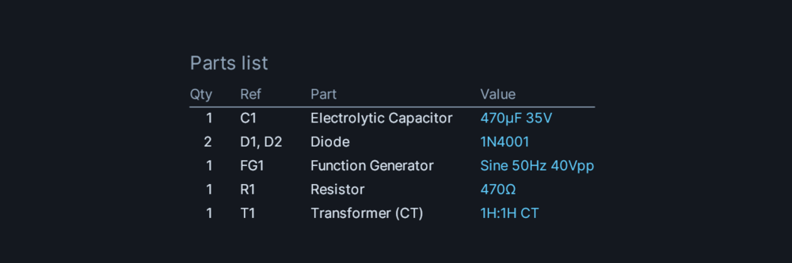
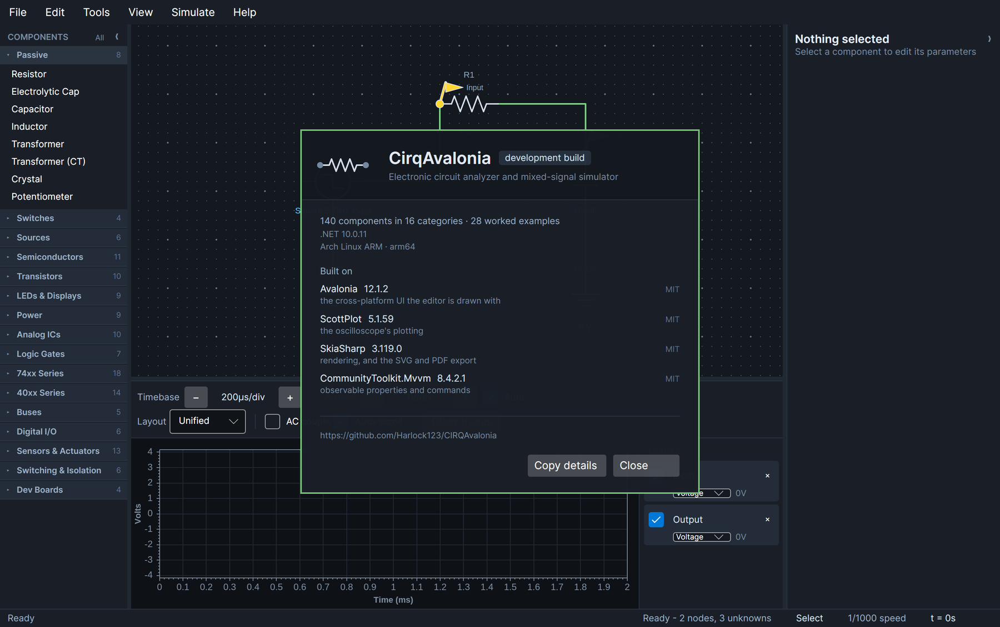

# CirqAvalonia User Guide

CirqAvalonia is a circuit editor and mixed-signal simulator. You draw a schematic, attach probes
where you want to look, and press run — the analog network is solved with Modified Nodal Analysis
while logic devices run on an event scheduler, in the same time loop.

This guide walks through the editor. If you want to know how the solver works instead, that is in
the [README](../README.md), and what changed between releases is in the
[changelog](../CHANGELOG.md).

**Contents**

1. [Running it](#running-it)
2. [The window](#the-window)
3. [Placing components](#placing-components)
4. [Working a running circuit](#working-a-running-circuit)
5. [Wiring](#wiring)
6. [Setting values](#setting-values)
7. [Probes and the oscilloscope](#probes-and-the-oscilloscope)
8. [Running a simulation](#running-a-simulation)
9. [Worked example: an RC low-pass](#worked-example-an-rc-low-pass)
10. [Digital and mixed-signal circuits](#digital-and-mixed-signal-circuits)
11. [Development boards](#development-boards)
12. [Saving and loading](#saving-and-loading)
13. [Exporting](#exporting)
14. [Appearance](#appearance)
15. [What version is this](#what-version-is-this)
16. [Keyboard reference](#keyboard-reference)
17. [When a circuit will not simulate](#when-a-circuit-will-not-simulate)

---

## Running it

```bash
dotnet run --project src/Cirq.UI
```

Requires the .NET 10 SDK. Nothing else — there is no install step and no configuration file to
write. Preferences are created on first use.

---

## The window


Five regions, and they stay put:

| Region | What it is for |
| --- | --- |
| **Menu bar** | Every command. File, Edit, Tools, View, Simulate, Help |
| **Components** (left) | The parts palette, grouped into collapsible categories |
| **Canvas** (centre) | The schematic. Pan, zoom, place, wire, probe |
| **Properties** (right) | Parameters of whatever is selected, with the circuit's **controls** beneath |
| **Scope** (bottom) | Timebase and vertical controls, the plot, and the trace list |
| **Status bar** | Active tool, node and unknown counts, speed, and elapsed simulation time |

Both side panels collapse to give the canvas more room — `F9` for the palette, `F10` for
properties, or click the chevron in either panel's header. A collapsed panel leaves a labelled rail
at the window edge; click the rail to bring it back.

---

## Placing components


Click a palette entry, then click the canvas. The part lands where you click, snapped to the grid.

The palette holds **164 components in 16 categories**:

| Category | Count | Contents |
| --- | --- | --- |
| Passive | 11 | Resistor, capacitor, electrolytic capacitor, inductor, transformer, centre-tapped transformer, potentiometer, crystal, ferrite bead, **common-mode choke** and transmission line — see [below](#common-mode-chokes) |
| Switches | 4 | SPST, SPDT, push button, **8-way DIP switch** |
| Sources | 7 | Ground, DC voltage, DC current, function generator, battery, solar cell, **noise source** — see [below](#noise-and-why-hysteresis-exists) |
| Semiconductors | 12 | 1N4148, 1N4001, Schottky, zeners, **varactor**, bridge rectifier, SCR, triac, diac, TVS and varistor — see [below](#tuning-with-a-voltage) |
| Transistors | 10 | NPN and PNP bipolars, N- and P-channel MOSFETs, **three JFETs** — see [below](#jfets) |
| LEDs & Displays | 9 | Six LED colours, seven-segment displays, **HD44780 character LCD** — see [below](#the-character-lcd) |
| Power | 10 | Fixed and adjustable regulators, TL431 shunt reference, ICL7660 charge pump, MC34063 switching controller, **TP4056 lithium charger** — see [below](#charging-a-lithium-cell) |
| Analog ICs | 12 | LM741, TL081, LM358, MCP6002 rail-to-rail, NE555, LM311, LM339, LM386 audio amp, INA126 instrumentation amp and an **AD633 analog multiplier** — see [below](#multiplying-two-voltages) |
| Logic Gates | 7 | AND, OR, NAND, NOR, XOR, XNOR, NOT |
| 74xx Series | 18 | Counters, decoders, flip-flops, shift registers (including the **74595**), multiplexers, Schmitt inverter |
| 40xx Series | 15 | CMOS gates, counters, flip-flops, analog switches and a **4046 phase-locked loop** — see [below](#phase-locked-loops) |
| Buses | 14 | I2C master, EEPROM, port expander, DS1307 clock, ADS1115 ADC, MCP4725 DAC and INA219 current sensor, SPI master, 1-Wire master and DS18B20 thermometer, serial terminal and device, **RS-485 transceiver**, level shifter — see [below](#rs-485-signalling-by-difference) |
| Digital I/O | 6 | Logic toggle, clock, rotary encoder, oscillator module, **ADC and DAC bridges** — see [below](#between-the-analog-solver-and-the-logic-engine) |
| Sensors & Actuators | 17 | DC motor, LDR, thermistors, buzzers, speaker, microphone, servo, stepper, thermocouple, load cell, HC-SR04 ranger, Hall switch, phototransistor, **reed switch** and **PIR motion sensor** — see [below](#sensors-and-actuators) |
| Switching & Isolation | 8 | Relay, fuses, optocouplers, ULN2003, H-bridge, **MOSFET gate driver** — see [below](#driving-a-mosfet-gate) |
| Dev Boards | 4 | Raspberry Pi, Arduino Uno / Nano / Mega — see [below](#development-boards) |

Click a category header to open or close it. **All** in the palette header toggles every group at
once — useful when you are hunting for a part and do not remember which group it is in.

Switches, push buttons and logic toggles are operated by **double-clicking them on the canvas**,
not through the properties panel. A push button is momentary; a switch latches. LDRs and
thermistors work the same way — double-clicking covers or warms them.

Anything you can operate is ringed with a small dot beside its designator, so you do not have to
remember which parts those are. Turn the rings off with **View > Mark Interactive Parts** once
they have served their purpose.

### Copying a part

Select a part and press `Ctrl` `C`, then `Ctrl` `V`: a duplicate appears a little down and to the
right, already selected and ready to drag where you want it. It is a **new part**, with its own
designator — copy `R4` and you get `R5` — and every value carried across, including the ones that
are easy to forget about: the model on an op-amp, the number of inputs on a gate, the waveform and
duty cycle on a generator. Eight identical current-limiting resistors is now eight keystrokes
rather than eight trips to the palette and eight visits to the properties panel.

Two details are worth knowing. The copy is taken **when you press `Ctrl` `C`**, not when you paste:
change the original afterwards, or delete it, and what comes out of the clipboard is still what you
copied. And **each paste lands further along** than the last, so pressing `Ctrl` `V` four times
gives you four parts spread down the canvas rather than four stacked on the same spot with only the
top one reachable.

Wires are not copied, because one part has no wires of its own — what it had were connections to
other parts, and those cannot mean anything on a duplicate. The copy arrives unconnected.

Everything you do to the schematic can be taken back with `Ctrl` `Z`, and put back with `Ctrl` `Y`
(or `Ctrl` `Shift` `Z`). The Edit menu names what it is about to reverse — **Undo Add Resistor**,
**Undo Move Capacitor** — so you are not guessing at what the last thing was.

Undo covers edits to the document: placing, moving, rotating and deleting parts, pasting copies of
them, wiring, attaching probes, and changing values in the properties panel. A drag across the canvas costs one step rather
than one per pixel travelled. Opening a file or loading an example starts a fresh history, since
there is nothing sensible to step back into.

What it does not cover is **operating** the circuit — double-clicking a switch, or pressing Run.
Those are things you do *to* a running circuit rather than edits to the drawing, and having them
fill the undo history would push your actual edits out of reach.

---

## Working a running circuit

A real circuit's controls are on its front panel, not scattered across its schematic. The
**CONTROLS** panel, under the properties panel on the right, gathers every one of them into a
single place — and they work while the simulation is running.


Switches, push buttons and logic toggles appear as toggles. Anything with a range — a
potentiometer's wiper, a thermistor's temperature, the light on an LDR or a phototransistor, a
magnet at a Hall sensor, the distance to an ultrasonic target — appears as a slider showing its
current value. Move one and the next time point is solved with the new value; nothing has to be
stopped or restarted.

A few things worth knowing:

- **The panel and the canvas stay in step.** Double-clicking a switch on the canvas still flips it,
  and the panel follows. It is a second way to reach the same parts, not a separate set of them.
- **Wide ranges are logarithmic.** Light spans six decades from a dark room to direct sun, and a
  slider laid out linearly across that would put everything a circuit responds to in the first
  half-millimetre of travel.
- **A part with several controls names each one** — a DIP switch reads `SW2 · 1` through
  `SW2 · 8`, while a lone switch just reads `SW1`.
- **Bench instruments have knobs too.** A supply's voltage, a generator's frequency, amplitude,
  offset and duty are all controls. Sweeping a frequency with the scope running is how you find
  where a filter turns over or an oscillator starts, and it beats stopping, typing a number and
  starting again.
- **The panel is not there when there is nothing to operate.** A circuit of only resistors shows
  no controls section at all rather than an empty box.

What appears is decided by the components themselves. A property marked `[Operable]` becomes a
control, which means a part added later gets one by saying so on the property rather than by
anything in the interface being changed.

---

## Wiring

Press `W` (or **Tools > Wire**), then:

1. Click a terminal to start.
2. Click empty canvas to drop a corner — wires route orthogonally, so corners are how you steer.
3. Click another terminal to finish.

Terminals highlight as the pointer approaches, so you can see what you are about to connect to
before you commit. A wire must end on a terminal; clicking empty space only adds a corner.

Press `V` to go back to the select tool.

---

## Setting values


Select a component and the right-hand panel fills with its parameters. Selected parts are outlined
on the canvas, so there is never a question of what you are editing.

Values accept **engineering notation**, the way you would say them out loud:

| You type | You get |
| --- | --- |
| `10k` | 10 000 |
| `2.2M` | 2 200 000 |
| `100R` | 100 |
| `4k7` | 4 700 |
| `100nF` | 100 × 10⁻⁹ |
| `1kHz` | 1 000 |

The panel is generated by reflecting over each component's public settable properties, which is why
every part has a complete editor and why the same set of values is what gets saved to a file. If
you can edit it, it is saved; if it is saved, you can edit it.

---

## Probes and the oscilloscope

Press `P` (or **Tools > Probe**) and click a terminal. A coloured pennant marks the node and a
matching trace appears in the scope.


The scope controls, left to right:

| Control | What it does |
| --- | --- |
| **Timebase −/+** | Seconds per division. The readout shows the current setting |
| **Vertical −/+** | Volts per division |
| **Auto** | Keeps the vertical range fitted to the traces. Using the vertical `−`/`+` buttons turns it off for you |
| **Layout** | *Unified* overlays all traces, *Stacked* offsets them into lanes, *Tiled* gives each its own axes |
| **AC couple** | Subtracts each trace's DC average before display |
| **Auto-scroll** | Follows the newest data instead of holding at t = 0 |
| **Clear traces** | Empties the buffers without resetting the circuit |

Each trace in the list has a checkbox to hide it, a live readout of its present value, and an `×`
to remove the probe entirely.

**Auto** is on by default and is the setting most people want: change a source's amplitude and the
waveform stays on screen instead of running off the top.

---

## Frequency response

The oscilloscope answers "what does this circuit do over time". **Simulate > Frequency Response**
(F7) answers the other question: what does it do to a **sine at each frequency**, from one end of a
span to the other. It is the second way of looking at a circuit, and a great many things that are
tedious to establish in the time domain are one picture here.

Put a probe where you want the answer, open the window, and it sweeps. The traces are your probes,
so nothing else has to be set up. Magnitude in decibels goes on top, phase in degrees below, and
frequency runs logarithmically across both — which is what a Bode plot is, and what every
datasheet's response curve is drawn on.

The line under the plot does the arithmetic most people open the window for: where each trace has
fallen 3 dB from its own maximum, which is the number a filter is specified by.

Things worth doing with it:

- **Where a filter turns over.** Sweep the RC low-pass example and read 159 Hz off the status line.
  Change the capacitor and it moves, without having to run a transient at each frequency and
  squint at the amplitude.
- **How much gain an amplifier has left.** An op-amp's gain-bandwidth product is a single number on
  a datasheet and a whole plot here: a gain of ten from a 1 MHz part is flat to about 90 kHz and
  falls away past it. Note that it is the product over the **noise gain**, so ten times gain turns
  over at a megahertz over eleven, not over ten — which is the sort of distinction a plot settles
  in a second.
- **What a ferrite bead actually does.** Its impedance curve is the picture its datasheet prints,
  and sweeping one is the quickest way to see that "600 Ω" is true at exactly one frequency.
- **Resonances you did not put there.** An unterminated stub of transmission line looks like a
  short circuit at its quarter-wave frequency. That is nearly impossible to find by stepping a
  generator and obvious the moment it is plotted.

### What it is, and what it is not

The sweep linearises the whole circuit about its **bias point**: every diode, transistor and
amplifier is replaced by its slope at the operating point it settled at. That is what makes the
answer exact — a capacitor at one frequency *is* an admittance of jωC, with no integration error
and no time step anywhere in the calculation — and it is also the whole of the limitation.

A small-signal answer says **nothing at all** about what a circuit does when the signal is large.
No clipping, no slew limiting, no distortion, no oscillation starting up. An amplifier that will
tear a waveform apart at two volts in has a perfectly respectable Bode plot. When the question is
about size rather than frequency, the oscilloscope is the instrument.

And the circuit has to have a bias point at all: something that will not settle has nothing to
linearise about, and the window says so rather than drawing a plot of nonsense.

### Which source drives the sweep

A **function generator** drives it, with an AC magnitude of one volt by default — so a response
comes back as a plain gain and needs no setting up. Its shape, frequency and offset mean nothing
here; a sweep asks about a small sine at each frequency in turn.

Supplies do **not** drive it. A DC source, a battery, a regulator: to a small signal those are
short circuits, which is what they are in any hand analysis too, and they simply hold their node
still. If you want a supply to inject a ripple — to ask how well something rejects it — give that
source an `AcMagnitude` and it will.

---

## Measuring current

A probe reads a **voltage** by default, but it can read the **current** into the pin it is attached
to instead. Pick which from the dropdown beside the trace in the scope's trace list.

That is worth knowing about, because a great deal of what a circuit is doing is only visible as
current. The holding current that drops a triac out at every zero crossing, the flyback spike a
relay coil produces, what a motor draws as it stalls, whether an LED is getting 5 mA or 50 — none
of it shows up in a voltage trace unless you put a shunt in and do the arithmetic yourself.

The sign convention is a clamp meter's: **positive is current flowing into the component through
the pin you clamped**. Probe both ends of a resistor and you get equal and opposite readings; probe
all three pins of a transistor and they sum to zero.

Each trace carries its own unit, so a current reads `26.4 mA` rather than `0.0264`. In **Tiled**
layout every trace gets its own axis, labelled with its own unit, which is the comfortable way to
look at a current and the voltage driving it together. In **Unified** layout they share one axis
and it is labelled for whatever is on it.

Changing what a probe measures clears the trace — the samples already recorded are in the wrong
units, and rescaling them would be a lie.

---

## Running a simulation

Transport lives on the **Simulate** menu and on three keys:

| Key | Action |
| --- | --- |
| `F5` | Run / pause |
| `F6` | Single step |
| `F8` | Reset back to t = 0 |

**Simulate > Speed** sets how fast simulated time advances against wall-clock time:

- Real time (1×)
- 1/10, 1/100, 1/1000, 1/10000 speed
- Maximum throughput — run as fast as the solver can, ignoring the clock

Slow it down to watch a counter tick; use maximum throughput to get a long waveform quickly. The
status bar shows the elapsed simulated time and the solver's rate while it runs.

The simulation starts from initial conditions: capacitors begin at their stated initial voltage and
inductors at their initial current, both zero unless you say otherwise. A source applied at t = 0 is
therefore a genuine step, not a circuit that has already settled.

---

## Worked example: an RC low-pass

Building the first screenshot from an empty canvas, to put the above together:

1. **File > New**.
2. From **Sources**, place a **Function Generator** on the left of the canvas.
3. From **Passive**, place a **Resistor** to its right, and a **Capacitor** to the right of that.
4. From **Sources**, place two **Ground** symbols below the generator and the capacitor.
5. Press `W` and wire: generator output → resistor left; resistor right → capacitor top; generator
   bottom → its ground; capacitor bottom → its ground.
6. Select the resistor and set **Resistance** to `10k`. Select the capacitor and set **Capacitance**
   to `100nF`.
7. Select the generator; set **Shape** to `Square`, **Frequency** to `500Hz`, **Amplitude Peak To
   Peak** to `4`.
8. Press `P` and click the junction between generator and resistor, then the junction between
   resistor and capacitor.
9. Press `F5`.

You should see a square wave and the exponential charge and discharge of the capacitor chasing it —
the RC time constant here is 10 kΩ × 100 nF = 1 ms, against a half-period of 1 ms, so the capacitor
gets roughly two-thirds of the way each time.

### The example browser

Everything above is also in **File > Examples...** (`Ctrl+Shift+E`), along with sixty-seven others.

They are grouped the way the component palette is — Fundamentals, Analog, Power Supplies, Switching
& Motors, Digital Logic, Timers & Oscillators, Buses & Interfaces, Sensors, Signal Integrity & RF,
Audio, Displays, Development Boards — with a description of whichever one is selected beside the list, and a search
box across all three of the name, the description and the group. So looking for `I2C` finds the
four bus examples, and looking for `hysteresis` finds the comparator circuit whose name you have
forgotten. Double-click to open, or select and press Enter.

Opening one replaces whatever is on the canvas, so save first if there is anything there worth
keeping.

The **Fundamentals** group is where to start, and the three in it are deliberately the three
simplest things a circuit does. **RC Low-Pass** is the one built by hand above. **Transistor
Switch** is a 2N3904 turning an LED on from a push button, which is the circuit that makes base
*current* rather than base voltage the thing you are choosing — probe the base and the collector
and watch how little of the former it takes to pull the latter down. **MOSFET Driver** is the same
idea at twelve volts into a 10 mH coil, and the diode across that coil is the point of it. Delete
the diode and run it again: the drain does not rise to a few hundred volts, it goes to a number
with seven digits in it, because the current in an inductor has to keep flowing and with the FET
off there is nowhere left for it to go. That figure is not a bug and not a prediction — it is what
the arithmetic says when nothing limits it, and on a bench the limit is the FET's avalanche rating
absorbing the energy, once or twice, until it does not.

---

## Digital and mixed-signal circuits


Logic parts are event-driven rather than solved at every time point. Outputs are stamped into the
analog network as Thevenin sources at the logic family's VOH/VOL, inputs are classified against
VIH/VIL, and transitions are queued at `t + tpd`.

What that means in practice is that logic and analog genuinely interact. You can hang a resistor
off a gate output and it will load it; a 555's internal comparators respond to the RC network you
built around them; a 7447 releases its unlit segments rather than driving them high, because it is
an open-collector sink driver and the model says so.

The transient loop truncates its own step so a time point lands exactly on the next queued
transition, so edges are not smeared across a step.

Useful examples to start from: **NAND Latch**, **Decade Counter**, **Ring Oscillator**,
**Digit Counter**, **Running Light**.

### Building a power supply

Three parts cover the usual linear supply, and each models the thing that actually bites:

- **Bridge Rectifier** (Semiconductors) — four real diodes, not an idealised block, so the output
  peak sits about 1.4 V below the input peak. Both halves of the cycle conduct, giving ripple at
  twice the input frequency.
- **Electrolytic Cap** (Passive) — polarised, with real series resistance. ESR is what actually
  sets the ripple on a smoothing capacitor, so it is solved rather than assumed.
- **Regulator 7805 / 7809 / 7812 / 7905 / LM317 / LD1117** (Power) — fixed and adjustable linear
  regulators, with dropout, current limiting and thermal shutdown.

An electrolytic reports being used outside its ratings, and is ringed in red on the canvas:

- **Connected backwards.** The classic destructive mistake — a reversed electrolytic vents. It
  has to be held backwards for a millisecond before it complains, so the startup transient of a
  supply coming up around it does not raise a false alarm.
- **Over its working voltage**, which is the other number printed on the can.

**File > Examples > Linear Power Supply** builds the whole chain — a 14 V secondary through a
bridge into a 1000 µF reservoir into a 7812. The two probes are the point: the reservoir rail
sags and recharges twice per mains cycle, and the regulated rail beside it is flat. It is the one
example that sets the simulation speed, because a 50 Hz cycle at the usual 1/1000 would take fifty
seconds of wall time.

**TL431** is a programmable shunt reference — a zener whose voltage you choose. Tie its reference
pin to its cathode and it is a fixed 2.5 V shunt; feed the reference from a divider off the cathode
and it holds the cathode at 2.495 × (1 + R₁/R₂). It needs a milliamp or so through it to regulate
at all, and sizing the feed resistor so the load takes everything is the classic way to end up with
a circuit that almost works, so it reports being starved.

**74HC14** is a hex Schmitt-trigger inverter, and its two thresholds are what make it useful. An
ordinary gate has one, so an input creeping through it produces a burst of output chatter. A
Schmitt input will not call a rising input high until it clears about 0.58 of the supply, nor a
falling one low until it drops past about 0.38 — and between them it remembers. That is what cleans
up a slow edge, debounces a contact, and lets a single gate with a resistor from output back to
input and a capacitor to ground free-run as an oscillator.

**Transformer (CT)** is the other way to rectify, and for fifty years it was the usual one. Its
secondary has a tap at the middle; take that tap as your zero volt line and the two ends swing in
opposite directions, so **two diodes give you full-wave rectification** instead of a bridge's four.
The saving is not the two diodes — it is that the current only ever passes through one of them, so
you lose one forward drop instead of two. At five volts that is most of a volt, which is why the
arrangement outlived the bridge in low-voltage supplies. Rectify each half separately against the
tap instead and you have a positive and a negative rail from one winding, which is where every
±15 V op-amp supply comes from.

The secondary is modelled as what it physically is — two windings in series sharing a core, each
with a quarter of the whole inductance, all three coupled — so the tap is a real connection to the
middle rather than an ideal half-voltage point, and loading one half unevenly pulls the other about
the way it does in practice. The windings have resistance, because a winding is a long piece of
thin wire; it is also what limits the inrush when the supply is first switched on.

**File > Examples > Full-Wave Rectifier** wires one up with two 1N4001s. Both halves are on the
scope against the rectified rail, and the rail sits one diode drop below the peaks rather than two.

Two smaller ones sit either side of it. **File > Examples > Half-Wave Rectifier** is one diode, one
100 µF reservoir and a 1 kΩ load off a 50 Hz secondary — the arrangement that only uses half the
cycle, so the capacitor is left to hold the rail up for a whole period between refills and the
ripple comes at the line frequency rather than twice it. Put the two rectifier examples side by
side and the reason nobody builds the half-wave one is in the ripple. **File > Examples >
Regulated Supply** is the other end on its own: a 7805 given 12 V, with the input and output
capacitors it wants and a 100 Ω load, so the dropout and the quiescent current are visible without
a rectifier in front of them.

**Inductor saturation.** An inductor has a `SaturationCurrent`, and it is left at zero — meaning
ideal — so nothing that worked before changes. Set it and the part behaves like iron: past the
knee the core cannot take any more flux, the inductance collapses, and the current stops being
limited by anything except resistance. That is the failure mode behind a switching supply that
works on the bench and dies at full load, and behind an inductor that gets hot without the
waveform ever looking wrong. It is worth setting on any inductor carrying real current, because a
part that is ideal at ten amps is not telling you anything.

Give the regulator headroom. It needs its dropout voltage above the output *at the bottom of the
ripple*, not on average — a supply that measures fine on a meter can still be dropping out on
every trough.

---

## Sensors and actuators

**DC Motor** is modelled electrically and mechanically at once, because the two are inseparable.
The armature is a resistance and an inductance in series with a back-EMF proportional to speed;
the torque is proportional to current, and the rotor's inertia integrates the difference between
that torque and the load.

That coupling is why a motor cannot be simulated as a resistor. At rest there is no back-EMF, so
the armature draws the **stall current** — a 12 V motor with a 3 Ω armature pulls 4 A — and only
as the rotor spins up does the back-EMF rise and choke the current back to a few hundred
milliamps. The startup surge is what trips supplies and welds relay contacts, and it falls out of
the model rather than being asserted.

Load the shaft and it slows until torque balances, so the current a motor draws is set by what it
is driving rather than by the supply. Load it past what it can turn and it sits stalled with
nothing but armature resistance limiting the current — the motor is ringed in red and the fault
named, because that is how they burn out.

**LDR** is a cadmium-sulphide cell whose resistance follows a power law, roughly
`R = R₁₀·(10/E)^γ` with γ near 0.8. A decade of light is a fixed ratio of resistance — about 6.3×
at that γ — so the part covers several decades between a dark room and daylight. That span is why
an LDR is normally read with a comparator against a divider rather than measured directly.

Double-click it on the canvas to cover and uncover it, the same as operating a switch, so a
light-sensing circuit can be exercised while the simulation runs.

**File > Examples > Night Light** is that comparator-against-a-divider, except the divider is a
**TL431** — and the reason is worth a moment. A threshold made from two resistors is a fixed
*fraction* of the supply, so it moves when the supply does: run the same circuit off a battery and
the light level it switches at drifts as the battery goes flat. The shunt reference holds 2.495 V
whatever is above it. Drop the rail from 5 V to 4 V in the inspector and watch the reference not
move.

The feed resistor is a kilohm rather than the 2.2 kΩ that looks sufficient at five volts, and that
is the same story from the other end: at four volts a 2.2 kΩ leaves the TL431 under its milliamp
and it stops regulating. Size it for the bottom of the supply, not the top.

There is an **SPDT switch** in the lamp's return path, throwing between the comparator's output and
ground, which is the auto/manual override every real one of these has. The lamp is wired from the
rail down to the switch, so what does the switching is a connection to ground — which is all an
open-collector output can offer.

**Thermistor** comes in both flavours. An NTC follows the Beta equation, `R = R₂₅·exp(B·(1/T −
1/T₂₅))` with the temperatures in kelvin — the real curve, and steeply non-linear: a 10 kΩ B3950
bead reads 33 kΩ at freezing and 2.5 kΩ at 60 °C. Treating that as a straight line is the usual
reason a home-made thermometer is right at one temperature and nowhere else. A PTC is specified by
a coefficient per kelvin instead, so it is modelled that way rather than by forcing one equation to
cover both.

Double-click it to swing between cold and warm while the simulation runs, and pair it with a
comparator to act on temperature.

**File > Examples > Thermostat** is that pairing, with the part that makes it work rather than
merely switch. An NTC against a fixed 10 kΩ feeds an LM311 compared with a mid-rail reference, and
its output drives an LED and an active buzzer. Drag **Temperature** in the CONTROLS panel and it
changes over.

The component to look at is the **470 kΩ from the output back to the input**. It shifts the
threshold the moment the output moves, so the temperature it switches off at is a degree or two
above the one it switches back on at. Delete it and the thermostat still works — right up until
the sensor reading wobbles across the threshold, at which point the output chatters and, on real
hardware, the relay buzzes and its contacts weld. A thermostat without hysteresis is not a slightly
worse thermostat; it is a device with a failure mode.

**Buzzer** comes in the two sorts you can buy, and the difference is the point rather than a
detail. A **passive** piezo is a capacitor: it turns a *changing* voltage into movement, so a
steady one does nothing at all. Wiring one across a pin that is simply switched high is the most
common reason a first buzzer circuit is silent — so that is reported, with the buzzer ringed in
red, rather than drawing a plausible current and leaving you to wonder. An **active** buzzer has
its own oscillator behind the element and DC is exactly what it wants.

A passive element sounds at whatever it is fed, and the frequency shown is measured from the drive
rather than assumed.

**Hall Sensor** is the A3144 sort of magnetic switch, and the part behind every fan tachometer,
bicycle speedometer and brushless motor that knows where its rotor is. Two things about it catch
people.

Its output is **open collector** — it pulls the pin down or lets go of it, and nothing else. With
no pull-up resistor it does not work badly, it does not work at all, exactly as an I²C bus does not
and for the same reason. That one is reported rather than left for you to find.

And it has **hysteresis**, which is the whole reason it is usable. A magnet approaching a sensor
with a single threshold would make the output chatter as the field wobbled either side of it, and a
wheel magnet passing at speed would give a burst of pulses instead of one. So it turns on at about
20 mT and off again at 10, and between the two it simply remembers what it was doing — feed it
15 mT and the answer depends on which way it got there.

Most of these are also **unipolar**: they answer to one pole and ignore the other entirely.
Turning the magnet round and getting nothing is the other half-hour people lose to this part, so
`IsUnipolar` is there and on by default. Double-click it to bring a magnet up and take it away.

**Phototransistor** is the light sensor to reach for when the LDR will not do, and the difference
is worth knowing before choosing either. An LDR is a **resistance** that falls as it is lit, so
what it does to a circuit depends on what it is wired in series with. A phototransistor is a
**current source** commanded by light: it passes a current proportional to what falls on it and,
until it runs out of voltage, does not much care what it is connected to.

The difference that usually decides it is speed. An LDR is a bulk photoconductor and takes tens of
milliseconds — it is useless above a few hertz, which is why no remote control, optical encoder or
pulse oximeter has ever contained one. A phototransistor is a junction and responds in
microseconds.

Being a current source is also what makes it awkward. The current is in microamps, and turning
that into a voltage is what the load resistor is for — too small and the output barely moves, too
large and it saturates in ordinary room light and stops following the light at all. `IsSaturated`
says when that has happened. Doing it properly means a transimpedance stage round one of the
op-amps in the palette.

**Ultrasonic Ranger** is the HC-SR04, and the whole part is a lesson in one idea: **the distance is
in the width of a pulse, and nowhere else**. Give TRIG at least ten microseconds high, and about
450 µs later ECHO goes up and stays up while the chirp is out and back — **58 microseconds per
centimetre**, which is simply the speed of sound over a round trip. Nothing on the wire tells you
the distance; your code has to time an edge, which is why driving one from an interrupt is a
different exercise from reading a sensor over a bus.

Both of its awkward behaviours are modelled, because both catch people:

- A trigger pulse shorter than ten microseconds is **ignored entirely**, so a sloppy `digitalWrite`
  pair that happens to take eight gets you nothing at all rather than a wrong answer.
- With nothing in range it does not stay quiet — it gives a **38 millisecond pulse** and gives up.
  Code with no timeout reads that as about six metres, which is why a ranger pointed at the sky
  reports something absurd instead of hanging.

Double-click it to move the target between `DistanceCentimetres` and `AlternateDistance` while the
simulation runs, and watch the echo pulse change width. **File > Examples > Ultrasonic Ranger**
has one pinged a hundred times a second with both pins on the scope.

### Two ways to notice a magnet

The **Hall sensor** and the **reed switch** answer the same question and have almost nothing else
in common, which is why both are here.

A reed switch is two springy ferrous blades in a glass tube that pull together when a magnet comes
near. What it has over the Hall switch is that it is a **contact**, not a semiconductor: it needs no
supply at all, draws nothing when idle, passes current either way round, and will switch mains if
asked. Every door and window sensor in every alarm system is one of these, sitting on a long cable
with nothing but the switch at the far end — which a part needing three wires and a pull-up could
not do. It also answers to **either pole**, because the blades are ferrous rather than magnetised,
where most Hall switches ignore one of them entirely.

What it has against it is everything mechanical. It is slow, hundreds of microseconds rather than a
few. It wears out. And it **bounces**: the blades snap together, spring apart and snap back several
times over the first half millisecond. Wire one to a pull-up, put the scope on it, and bring a
magnet up — a single magnet passing produces a burst of edges. Feed that into a counter and you
count five; feed it into an interrupt and you get five interrupts. **File > Examples > Reed Switch
Bounce** is exactly that, a reed switch clocking a 7490: bring the magnet up once from the CONTROLS
panel and watch the count move several places. That is what debouncing is for,
and it is the difference you can see between this part and the Hall switch beside it, which does
not bounce at all. Opening does not bounce either, in the model as in life: there is nothing for
the blades to rebound off.

**File > Examples > Hall Counter** is the other half of that comparison, built the same way: a Hall
switch with a pull-up, clocking a 4040. Drag **Field** in the CONTROLS panel up past 20 mT and back
to zero — one pass, one count, every time. Do it four times and the counter has advanced four
places, where the reed switch beside it would have given some larger number nobody chose.

It is an **open-drain** output like almost every Hall switch sold, so the 10 kΩ is not optional:
take it out and the part says so rather than quietly reading low. And the two thresholds are what
make the count clean — 20 mT to operate and 10 mT to release, so a magnet lingering at fifteen has
already been decided about.

### PIR motion sensors

The white plastic dome on every security light. **Passive** infrared, which is the first thing to
get straight — it emits nothing. Behind the lens is an element that notices the infrared a warm
body gives off, and the segmented lens chops the scene into stripes so that something moving across
it sweeps warmth from one segment to the next. That is what it detects: not heat, and certainly not
presence, but **change** in heat across its field of view. Which is why it will not see somebody
standing still, and why it triggers on a radiator coming on.

Two behaviours matter when you wire one up, and both are here.

**It holds its output high long after the movement stops** — seconds to minutes, set by a trimmer
on a real board and by `Hold` here. It is not reporting what is happening now; it is reporting that
something happened recently, and anything sampling the pin and believing it is seeing the present
will be wrong for the whole of the hold time.

**Retriggering is a jumper, and the wrong setting is maddening.** Retriggerable restarts the hold on
every fresh movement, so the output stays high while somebody keeps moving. Single-shot does not:
the output drops at the end of the hold whatever is going on, then blanks for a moment before it
can fire again — so the light goes out while you are still standing under it. Both settings are in
the CONTROLS panel; turn `Movement` on and off and watch the difference. **File > Examples > Motion
Light** has one holding a lamp on, with a short warm-up so it does something in the first minute.

And when power is first applied it needs a **warm-up** of some tens of seconds, during which a real
one produces nonsense and this one simply refuses to trigger. That is enough to explain a sensor
that seems dead for the first minute.

---

## Transmission lines, and why a wire stops being a wire

Every other connection in this program is instantaneous. Change a voltage at one end of a wire and
it is that voltage at the other end in the same instant, because a wire is a wire. That assumption
is the first one to fail as things get faster, and it fails in a way nothing in a schematic hints
at.

What a length of cable or a track on a board really does is carry a **wave**. Launch a step into
one end and it travels at some fraction of the speed of light, arriving later — about **five
nanoseconds per metre** in ordinary coax or in a board track, which is the rule of thumb worth
remembering. While the wave is in flight the line looks to whatever is driving it like a plain
resistor of Z₀ ohms — fifty for instrument coax, seventy-five for video, around a hundred for a
differential pair — **whatever is connected at the far end**, because nothing about the far end has
reached the driver yet.

Then the wave arrives, and what it finds there decides how much of it comes **back**:

| Far end | What returns |
| --- | --- |
| Matched to Z₀ | Nothing. The wave is absorbed and that is the end of it |
| Open circuit | All of it, the same way up — so the far end briefly sits at **twice** the incident voltage |
| Short circuit | All of it, inverted |
| Anything else | (Z<sub>L</sub> − Z₀) / (Z<sub>L</sub> + Z₀) of it |

And then the reflection travels home, meets whatever the source impedance is, and some of *that*
turns round again.

Place a **Transmission Line** from the Passive group, drive it from a function generator with an
output resistance, and put probes on both ends. With a metre of line and an edge of a nanosecond:

1. **Set the source resistance to 50 Ω and leave the far end open.** The near end sits at *half*
   the generator's voltage for the first five nanoseconds — the commonest surprise on a bench, and
   nothing is wrong. At 5 ns the far end jumps to the full voltage, twice what arrived. At 10 ns
   the near end catches up, and everything is still: a matched source absorbs the reflection, so
   there is no second round.
2. **Drop the source resistance to 5 Ω.** Now the reflection bounces off the driver as well, and
   the far end climbs to its final voltage in a **staircase**, a step every ten nanoseconds. On a
   scope this looks like a broken driver and is nothing of the kind.
3. **Put 50 Ω across the far end instead.** One clean edge, arriving late, and nothing comes back.
   That is what termination is for.

The third case is also where the cure people reach for turns out to be in the wrong place. A series
resistor at the **driver**, chosen to make the source impedance match the line, quietens a line
that a resistor at the far end could not — because it absorbs the reflection coming home rather
than preventing the one going out. It is why series termination is a single resistor next to the
chip and costs nothing in DC current.

**File > Examples > Reflections** is that circuit with the terminator on a switch, so you can close
SW1 from the CONTROLS panel while it runs and watch the ringing disappear.

The practical question is only ever whether the delay matters compared with your edges. Ten
centimetres of track is 500 picoseconds. At 1 MHz that is nothing and the track is a wire. At 500
MHz it is a quarter of a cycle and the track is a component.

Two settings shape it: **Velocity Factor** is how fast the wave goes as a fraction of the speed of
light — about two thirds for solid coax and for a board track — and **Loss** is the one-way
attenuation in decibels, which is zero by default and is what makes a long line's ringing die away
rather than going on for ever.

One thing to know about simulating them: a line **cannot be stepped over**. If the solver took a
step longer than the delay it would step past the whole of the behaviour, so the component asks the
engine for time points of its own, a fraction of the delay apart. A short line therefore makes the
whole simulation take small steps, which is in the nature of the thing rather than a setting to
tune.

---

## Ferrite beads

The part on every supply rail that almost nobody can describe. It is drawn like an inductor and it
is not being used as one.

An inductor **stores** energy and gives it back. That is what makes an LC filter ring, and it is
why putting an ordinary inductor in a supply rail to quieten it can make things worse: the
inductance and the decoupling capacitor after it form a resonant circuit, and noise at that
frequency comes out **larger** than it went in.

A bead is lossy on purpose. At low frequencies it is a piece of wire — tens of milliohms, and the
supply current goes through it without noticing. As the frequency climbs, the ferrite begins to
absorb rather than store, and somewhere near a hundred megahertz the thing is essentially a
resistor of a hundred ohms or more, turning the noise into heat instead of handing it back. Climb
further and the winding's own stray capacitance shorts it out, so the impedance falls away again.

Which is the first thing to take from it: **a bead has a band, and outside that band it is not
there**. The number on the datasheet — "600 Ω" — is the impedance at *one frequency*, conventionally
100 MHz, and not a property of the part at any other. The same bead is under thirty ohms at a
megahertz. Choosing one by that headline figure, for noise nowhere near 100 MHz, is the usual way
of fitting a bead that does nothing.

The second thing follows from it, and is worth trying in the simulator because it is genuinely
surprising: **a bead only damps ringing that is inside its band.** Put one in front of a hundred
nanofarads and the pair resonate at a few hundred kilohertz, where the bead is still an inductor
and contributes no loss at all — so it rings exactly as an ordinary inductor would, and "just fit
a bead" has achieved nothing. Put the same bead in front of the few picofarads of a fast logic
input, where the ringing is up near its peak, and the overshoot goes away.

Its settings are the two numbers a datasheet gives — the **peak impedance** and the **frequency**
it happens at — plus a **sharpness** for how broad the peak is and the **DC resistance** of the
wire through it, which is what decides how much voltage it drops at an amp or two.

**File > Examples > Ferrite Bead** puts one where it belongs: between a rail carrying a couple of
hundred megahertz of rubbish and a chip's supply pin, with both sides probed. Turn the noise
bandwidth down in the CONTROLS panel and watch the bead stop helping, because the noise has left
the band it works in.

---

## Common-mode chokes

The other way of dealing with noise on a cable, and it works on a completely different principle
from the bead above. A bead selects by **frequency**. A common-mode choke selects by **which way
the current is going**, and it is the only part in the palette that does.

Both conductors of a pair go through it, and the winding sense is the trick. Current going out
along one and back along the other — the **differential** current, which is your signal — makes two
equal and opposite fluxes that cancel in the core. As far as that current is concerned the choke is
not there: a microhenry of leakage and nothing else.

Current going the *same* way along both — **common-mode** current, which is noise riding on the
pair and returning through the ground, the chassis, or the air — makes fluxes that add. That
current sees the full inductance of both windings, and it is stopped.

So one can be fitted in series with a signal **without attenuating the signal at all**, which no
ordinary inductor can manage. That is why one sits at the entry of every mains inlet and across
every USB and Ethernet pair.

Sweep one in **Frequency Response** and the two impedances are the whole component in one picture:
at a megahertz a 1 mH choke is over ten kilohms to common-mode current and under ten ohms to the
signal. Both numbers are at the *same* frequency, which is what makes it not a filter.

The setting that matters is **Coupling**. It is never quite one, and what is left over is the
leakage inductance — which is the part the signal does see, and therefore what decides how fast a
pair can still run through one.

**File > Examples > Common-Mode Choke** does both at once, which is the only way to see that it is
one component and not two. A 100 kHz signal is driven across the pair; a 5 MHz interferer is driven
against the pair and ground together, the way every switching supply near a cable does it. The pair
is terminated with two 50 Ω resistors and the midpoint grounded, so common-mode current has a path
home and the choke has something to push against.

Out the far end: the signal arrives at essentially its full two volts, and the five volts of
common-mode noise arrives as about **fifty millivolts**. Same component, same instant, two answers
a hundred times apart.

Wind the **Coupling** down towards 0.9 and watch the rejection collapse — that is leakage
inductance becoming the dominant term, and it is why the number on a real choke's datasheet
matters more than its inductance.

---

## Tuning with a voltage

Reverse-bias any junction and its depletion layer widens. That layer is an insulator with
conducting silicon either side of it, which is a capacitor, and a wider one is a smaller capacitor.
A **varactor** is a diode built to make that relationship large, repeatable and worth using:

> C = C₀ / (1 + V/V<sub>j</sub>)<sup>m</sup>

Put one across an LC tank, take the knob off the variable capacitor and replace it with a
potentiometer feeding a few volts of bias, and the resonance moves. That is a car radio, and it is
why the tuning control can be on the front panel while the tuned circuit is up at the aerial.

**File > Examples > Varactor Tuning** is that circuit. Move **RV1** in the CONTROLS panel, then
open **Simulate > Frequency Response** and sweep it — the peak itself moves, which is a clearer
picture than watching what the peak does to one particular signal.

Two things decide whether one is any use:

- **How far it swings.** The grading coefficient `m` is about 0.5 for an ordinary junction, which
  gives roughly two to one over a usable bias. The hyperabrupt doping profiles made for tuning give
  1 or more, and ten to one — which is why tuning varactors are a separate part rather than people
  using any old diode.
- **Staying reverse-biased.** Let the signal swing the junction into conduction and it stops being
  a capacitor and starts being a diode. That is the usual reason a varactor-tuned oscillator
  distorts or will not start, and the symbol marks it when it happens.

One piece of wiring is easy to leave out and stops the whole thing working: the **blocking
capacitor** between the tank and the varactor. Without it the tank inductor is a short at DC, the
cathode is grounded through it, no bias ever reaches the junction, and the tuning control does
nothing whatever.

---

## Driving a MOSFET gate

A gate is a **capacitor**. Tens of nanofarads, once the Miller effect is counted, and switching the
transistor means moving all of that charge. The arithmetic is the whole of why gate drivers exist:
50 nF taken to 10 V in 50 ns needs **ten amps**. A microcontroller pin manages twenty milliamps, so
driving a power FET straight from one does not fail — it just takes five hundred times longer.

And slow switching is where the heat comes from. A MOSFET is cheap to keep on, because
R<sub>DS(on)</sub> is milliohms, and cheap to keep off, because nothing flows. It is expensive
*in between*, passing most of the current with most of the voltage across it, which for those
microseconds is a hundred times the power it dissipates the rest of the time. Switch slowly at
100 kHz and the transistor spends a fifth of its life in that state; it will be too hot to touch,
and nothing in the schematic will say why.

Place a **Gate Driver** from Switching & Isolation between the logic and the gate and the picture
changes twice over:

- **Speed.** Charge over current: 47 nF to ten volts is 470 nanocoulombs, and two amps moves that
  in about 235 nanoseconds. Put a capacitor on the driver's output to stand in for the gate, probe
  it, and compare the edge with and without the driver in the way.
- **Voltage.** The gate goes to the **driver's** supply, not the logic rail. A FET whose
  on-resistance is specified at 10 V does not get there on 3.3 V — it is not off, and not properly
  on either, which is the worst place for it to be. A logic pin cannot take the gate above its own
  rail at all, however fast it is.

It sinks harder than it sources, as real drivers do, because getting a FET *off* in a hurry is what
keeps a half-bridge from shooting through. And it has an **under-voltage lockout**: run it from too
little supply and it says so rather than quietly half-driving the gate.

**File > Examples > Gate Driver** is the comparison in one schematic: one clock, two identical
MOSFETs, one gate straight off the logic pin and the other through a driver, with both gates on the
scope.

---

## Switching and isolation

Three parts for the boundary between a control circuit and the thing it controls. Each reports the
mistake that actually destroys it.

**Relay** — a coil and a changeover contact. The coil is an inductor, so interrupting its current
produces `v = L·di/dt`: hundreds of volts, backwards, in microseconds. That spike is what kills the
transistor driving it, and the relay says so — the coil is ringed in red and the status bar names
the fault. Put a diode across the coil, cathode to the positive end, and the warning goes away
because the spike now has somewhere to go.

Pull-in and drop-out are deliberately different currents, so a coil sitting near the threshold
holds its state instead of chattering. `COM` connects to `NC` at rest and to `NO` when energised.

**File > Examples > Stepper Motor** is the ULN2003's own reason for existing. A 4017 walks one
output at a time — which is exactly the four-phase wave-drive sequence, for free — through four
Darlington channels into the windings of a stepper, and the shaft follows one step per clock. Watch
the two coil traces: as each winding is released its node rises to a diode drop **above** the
twelve volt rail and stops there, because COM is tied to that rail and the array's freewheeling
diodes have somewhere to send the current. Disconnect COM and the same instant reads in the
millions of volts, which is the arithmetic of `v = L·di/dt` with nowhere for the current to go.

**Fuse** — opens on its melting integral rather than on instantaneous current, which is why a real
fuse survives an inrush many times its rating: the heat has to accumulate. A fuse carries its rated
current for ever, so only the excess counts. Doubling the rated current on a 1 A / 0.5 A²s fuse
takes about a sixth of a second; five times the rating takes twenty milliseconds. Once blown it
stays blown.

**ULN2003** — seven Darlington drivers, and the way logic drives anything with a coil in it. A
74xx output will not run a relay or a stepper winding, and doing it with a transistor per channel
is seven transistors and fourteen resistors.

Every channel **sinks**, which is the thing to get right: the load goes between the supply and the
output pin, not between the output and ground. An output that is off is not driving low, it is
disconnected — so a load wired from an output down to ground does nothing at all, which is the
usual first mistake. Being a Darlington it does not saturate to nothing either: about a volt stays
across a conducting output, which matters when a 5 V relay is running off a 5 V rail. Tie the COM
pin to the load's supply and the internal flyback diodes have somewhere to send the inductive kick;
they are modelled, so leaving that pin off has the consequence it has on a breadboard rather than
none. Note also that there is genuinely no supply pin on a ULN2003 — the part runs on whatever it
is sinking from — so the Vcc terminal on the symbol is the ground pin under another name, and
connecting it to a rail shorts the ground pin to that rail.

**Optocoupler** — an infrared LED facing a phototransistor with no conductive path between them, so
the output side can sit at a completely different potential. This is the honest answer to "how do I
switch something dangerous from a 3.3 V board".

The isolated side still needs its own ground reference. That is a property of isolation, not a
limitation of the simulator — two circuits with nothing at all between them have no solution. A
real device leaks through some hundreds of gigohms and that is what is modelled, which keeps the
matrix solvable without meaningfully coupling the halves.

**File > Examples > Relay Driver** puts three of these in a row between a logic pin and a coil,
because no one of them is enough on its own. A clock drives the optocoupler's LED through 330 Ω —
milliamps, not the microamps people budget, because the transfer ratio is a current ratio and a
tenth of a milliamp in gives a tenth of nothing out. The phototransistor is wired as an emitter
follower so the output goes high when the LED lights rather than the other way round. That feeds a
ULN2003 channel, which sinks the coil. And the relay drives both lamps: one off its normally-open
contact and one off its normally-closed, so the changeover is on the screen rather than inferred.

Two details in it are the ones that bite. **COM goes to the coil's supply** — that is the ULN2003's
freewheeling diode path, and with it the output stops a diode drop above 12 V when the channel lets
go. Disconnect it and watch what the same turn-off does instead. And the ULN2003 has **no supply
pin at all**: it is powered by whatever it is sinking from, so the Vcc terminal on the symbol is
its ground pin under another name. Wire that to a rail and you have shorted the ground pin to the
rail, which the solver will tell you about in the bluntest possible terms.

---

## The 40xx series

The 40xx CMOS parts have a palette group of their own rather than sitting among the 74xx ones,
because they are a different family with different habits — and mixing the two has a specific way
of going wrong, covered at the end of this section.

**Gates.** The 4001 (quad NOR), 4011 (quad NAND), 4070 (quad XOR), 4071 (quad OR), 4081 (quad AND)
and 4069 (hex inverter) do what their 74xx counterparts do, more slowly. The 4011 is the one you
reach for by reflex, the way a 7400 is in TTL.

The pinout is the trap. A 7400 puts gate two on pins 4 and 5 driving 6, and gate three on 9 and 10
driving 8; a 4011 puts gate two on 5 and 6 driving 4, and gate three on 8 and 9 driving 10. Only
gates one and four agree. Dropping a 4011 into a board laid out for a 7400 leaves you with two
working gates and two that do nothing sensible, which is a long afternoon if you are not expecting
it — so the parts here have the pinouts they really have, and wiring one as if it were the other
is a mistake you can make on the canvas too.

The family is at least consistent with itself: where TTL moves the 7402's outputs to pins 1, 4, 10
and 13, the CMOS NOR has exactly the same pinout as the CMOS NAND.

**4093** — the 4011's function and pinout with hysteresis on every input, and the reason is that it
makes an oscillator out of almost nothing. Tie one gate's inputs together, run a resistor from its
output back to them and a capacitor from them to ground, and it runs: the capacitor charges until
it crosses the upper threshold, the output flips, and it discharges until it crosses the lower one.
Four gates gets you four oscillators, or one oscillator and three gates to debounce the switches
feeding it. The period is the two exponentials end to end and the tests predict it rather than
record it.

**4013** — a dual D flip-flop, the same job as a 7474 with one difference that catches everybody:
set and reset here are **active high**, where the 7474's preset and clear are active low. A 7474
with those pins floating sits there and clocks; a 4013 wired the same way is held wherever the
noise on those pins decides. Tie them low. Feed Q' back to D and it halves the clock, which is what
most of them end up doing.

**4017** — a decade counter that decodes for you. Where a 7490 counts in BCD and needs a decoder to
show anything, exactly one of the 4017's ten outputs is high at a time and it walks along them on
each clock. That is the part behind every LED chaser: ten LEDs, ten pins, no decoder. Carry-out is
high for the first five counts, so it divides by ten and chains straight into the next stage.

**4040** — twelve flip-flops in a chain, so Q1 is the clock halved and Q12 is the clock divided by
4096. It is what you use to get from something fast to something slow. It counts on the **falling**
edge, the other way round from the 4017 beside it, and its reset is active high, so tie that low
too. Being a ripple counter rather than a synchronous one, its stages do not change together — a
real 4040 shows brief false codes as the carry walks down the chain, which is why decoding its
outputs directly is a way to collect glitches.

**4060** — fourteen stages like the 4040, plus the thing that makes it the part behind almost
every long-delay timer ever built: an oscillator of its own. Hang a resistor and a capacitor off
three pins and the chip clocks itself, so one part takes you from nothing to a divided-down output.

The oscillator is not a number you set here. `RS` is the input of an inverter, `REXT` is that
inverter's output, and `CEXT` is the output of a second one behind it; those three pins and your
own Rt and Ct are the whole circuit. The timing node charges towards REXT through Rt, and each time
it crosses the threshold CEXT flips and shoves the node a supply's worth the other way through Ct.
So the frequency comes out of the network — change a resistor on the canvas and it changes, the way
it would on a breadboard.

Wire it the way the datasheet does — Rt from REXT, Ct from CEXT and Rs from RS, all three meeting
at one node — and it lands on the datasheet's `f = 1/(2.3·Rt·Ct)`. Rs wants to be several times Rt.
Its job is to keep the input protection diodes out of the timing, because the capacitor throws the
node a whole supply past the rail twice a cycle and something has to catch it. Those diodes are
modelled, so leaving Rs out has a consequence here rather than none.

Three things about this part regularly cost an afternoon, and all three are modelled. It counts on
the **falling** edge. Master reset is active **high** and stops the oscillator as well as clearing
the count, so a floating MR pin gets you a chip that does nothing whatsoever. And the first three
stages are not brought out, nor is the eleventh — the outputs run Q4 to Q10 and then jump to Q12,
so the divisions you can have are ÷16 up to ÷1024, then ÷4096 to ÷16384. If you were counting on
÷2048, it is not there.

You can also ignore the oscillator entirely: drive RS yourself, leave REXT and CEXT floating, and
it is a plain fourteen-stage counter.

**File > Examples > 4060 Timer** is the self-clocking arrangement with nothing else in it: 10 kΩ
and 100 nF on the timing pins, 47 kΩ for Rs, and an LED on Q6. The three probes are the timing
node, Q4 and Q6, so the oscillator and two of its divisions are on the scope together. Change the
capacitor to 220 nF while it runs and every trace slows in proportion — the frequency is coming out
of the network rather than out of a property.

**4511** — the 7447's counterpart. That part sinks current from a common-**anode** display; this
one sources it into a common-**cathode** one, so its outputs are active high and the two are not
interchangeable. It also has a latch the 7447 lacks: hold `LE` high and the display freezes on
whatever was decoded while the counter behind it carries on. Inputs above nine blank the display
rather than showing the odd glyphs a 7447 produces.

**4066** — four independent analog switches, and one of two parts here that are not logic at all.
The switched pins carry whatever you put on them — audio, a sensor divider, a reference — and the
control pin only decides whether the path exists. Neither switched pin is an input or an output,
which is what *bilateral* means. A closed switch is some tens of ohms rather than a short, so
feeding a low-impedance load through one loses real signal.

**File > Examples > Analog Switch** has four generators at four frequencies, one into each channel,
all four far sides tied to one node, and a **DIP switch** on the control pins. Close one section
and that generator arrives at the common node within about three millivolts of itself — eighty ohms
of switch against a hundred kilohms of load is a rounding error, which is the right way to use one.

Now close a second section. The two generators are wired directly together through a hundred and
sixty ohms, and the common node departs from either of them by the better part of a volt: what
comes out is neither source, and no amount of looking at one generator explains it. That is the
mistake four independent switches allow and the 4051 below cannot make.

Each control pin has a 100 kΩ holding it down when its DIP section is open. A CMOS control input
left floating decides for itself, and a switch that opens and closes according to what the board
picked up is worse than one that is simply stuck.

**4051** — the 4066 with an address decoder in front of it: three address pins pick one of eight
channels and connect it to the common pin, leaving the other seven open. The path is bilateral
here too, so the same part reads eight sensors into one ADC pin or fans one signal out to eight
places, depending only on which end you drive. Inhibit is active high and disconnects everything,
which is how you park it or gang several onto one bus. Because the decoder only ever closes one
path, there is no way to short two sources together by accident — which four separate 4066 switches
will happily let you do.

**File > Examples > Staircase Generator** puts the 4040 and the 4051 together into the classic use
for both. Three stages of the counter are three address bits, so the mux walks its eight channels
in order; the eight channels are tapped off a ladder of eight equal resistors between the rail and
ground; and the common pin therefore climbs in eight even steps of about 0.61 V and drops back. A D/A converter
made of one counter, one switch and some resistors, and a good picture of what "bilateral" buys
you — the signal path here runs from the ladder *into* the common pin, the opposite direction to
the one the part is usually drawn doing.

### Mixing CMOS with TTL

These are CMOS, not TTL, and that matters the moment the two meet. A 4000-series input on a 5 V
rail wants 3.5 V before it will call a level high, and a 74xx output only guarantees 3.4 V. A TTL
part driving a CMOS input directly is therefore a circuit that works on someone's bench and not in
the simulator, or the other way round, depending on the particular chips. Pull the TTL output up to
the rail with a few kilohms, or drive the CMOS part from something that swings rail to rail.

Going the other way is fine: a CMOS output swings to within 50 mV of both rails, which is more than
a TTL input asks for.

CMOS is also much slower. The gates here are modelled at around 90 ns at 5 V against 11 ns for the
TTL equivalents, which is the real difference and occasionally the reason a design that works in
one family does not in the other. A real part speeds up substantially at 15 V; that is not
modelled.

---

## Phase-locked loops

A **4046** is a voltage-controlled oscillator, two phase comparators, and nothing else. Everything
interesting about a PLL happens *outside* the package, in the loop filter you have to add — which
is why the part has a reputation for being difficult and why it is so satisfying once it is not.

What it does is easy to say. The VCO runs at whatever its control voltage asks for. A phase
comparator looks at the VCO against the incoming signal and puts out an error. The filter turns
that error into the next control voltage. Close that loop and the VCO is dragged onto the input —
not merely to the same frequency but to the same **phase**, which is what makes it different from
an oscillator you tune by hand.

**File > Examples > Phase-Locked Loop** is that circuit. Watch the control voltage climb while the
loop hunts, and then go flat. The flat line is lock.

### Lock range and capture range

Two numbers people conflate, and they are genuinely different.

**Lock range** is how far the input can drift while the loop is *already locked* and still be
followed. It is set by how far the VCO can go — R1 and C1 — and it is wide.

**Capture range** is how close the input has to be before the loop can grab it *from cold*. It is
set by the loop filter, and it can be far narrower.

A PLL that holds a signal perfectly once locked and refuses to lock onto the same signal from a
standing start is not faulty. It is being asked to capture from outside its capture range, and the
answer is a different filter rather than a better chip. Try it: in the example, switch to
comparator I and drop the signal 15 kHz away from where the VCO idles. It never finds it. Walk the
same signal up in three kilohertz steps and it holds every one of them.

### Which comparator

That difference is a property of the **comparator**, not of PLLs in general, and choosing between
the two is the one design decision the chip itself forces on you.

| | Comparator I (pin 2) | Comparator II (pin 13) |
| --- | --- | --- |
| What it is | An exclusive-OR | Edge-triggered, three-state |
| Locks at | 90° | 0° |
| Capture range | Narrower than the lock range | The same as the lock range |
| Noisy input | Copes well | Upset by extra edges |
| Harmonics | Will happily lock onto one | Cannot be fooled |
| When locked | Still putting out a square wave, so the filter has ripple to remove | Lets go of its output entirely — no ripple at all |
| Telling you | Nothing | Pin 1, which is the only lock indication there is |

Comparator II is a phase-*frequency* detector: it knows which of the two is faster, not merely how
far apart they are, which is why it pulls in from anywhere in the VCO's range. That is usually what
you want, and the reason pin 1 exists is that a comparator sitting silently in its third state
looks exactly like one that has lost the signal altogether.

One more setting worth knowing: **R2**, the offset resistor on pin 12, puts a floor under the VCO.
Leave it out — the default — and the oscillator stops dead at zero volts in, which is why a loop
that has lost lock can take so long to find its way back up.

---

## Multiplying two voltages

An **AD633** takes two differential inputs and gives you their product:

> W = (X1 − X2)(Y1 − Y2) / 10 V + Z

The ten volts in the denominator is what makes the part usable, and it is the first surprise:
two inputs at 5 V give **2.5 V** out, not 25. Without the divisor, full scale in would ask for a
hundred volts and the part would spend its life against a rail.

One chip, and a remarkable number of jobs — all of which are the same job read differently:

- **Amplitude modulation.** Carrier into X, audio into Y, and the output is one multiplied by the
  other. That is what AM *is*, rather than something done to a carrier.
  **File > Examples > Amplitude Modulation** is exactly that, with the envelope on the scope.
- **Mixing.** Two sines multiplied give their sum and difference and nothing else, which is every
  superheterodyne receiver ever built.
- **Squaring, and from it true RMS.** Tie X to Y, average the output and take the root.
- **A voltage-controlled amplifier.** Signal into X, gain into Y.
- **A phase detector.** Multiply two signals of the same frequency and the average of the product
  is the cosine of the angle between them.

The Z input adds straight through to the output, which is what lets one of these sum as well as
multiply.

---

## Driving a motor both ways

A single transistor can only turn a motor *on*. Running it backwards means being able to put the
supply on either terminal and ground on the other, and the only arrangement that does that is four
switches in an H around the motor — which is where the **H-Bridge** gets its name and why there is
no simpler way.

Two inputs and an enable choose what happens, and all four input combinations matter:

| EN | IN1 | IN2 | What happens |
| --- | --- | --- | --- |
| high | high | low | **Forward** — supply on OUT1, ground on OUT2 |
| high | low | high | **Reverse** |
| high | same | same | **Brake** — both outputs to the same rail, so the motor is shorted to itself |
| low | — | — | **Coast** — everything released |

**Brake and coast are not the same thing**, and it is the distinction people most often get wrong.
Braking shorts the motor so its own back-EMF drags it to a halt; coasting lets it spin down. A
driver that stops dead when you cut the drive is braking, and one that drifts on is coasting —
decide which you want before wiring it.

**Shoot-through** is the failure this part exists to let you make safely. Turn the top and bottom
of one leg on together and there is a path from the supply to ground through two switches and no
motor at all: a dead short, limited only by how good the switches are. Real drivers decode the
inputs so it cannot happen, which is what `PreventShootThrough` models. Turn it off — as a bridge
built from four loose MOSFETs effectively is — and both inputs high becomes a short instead of a
brake, and it is reported with the watts it is throwing away.

Two smaller things the model will show you. The **switches keep some of the supply**: at 1.2 Ω
each against a 12 Ω motor, two in the path cost you a sixth of it, which is why on-resistance is
the number on the front of a driver's datasheet. And the four **body diodes** are there because a
motor is an inductance — when the switches open, its current has to go somewhere, and without them
the outputs would fly to whatever voltage it took to stop the current dead.

**File > Examples > Motor Reversing** wires one up with three switches you can flip while it runs.

---

## Charging a lithium cell

A lithium cell cannot simply be connected to a supply. Put five volts across a cell sitting at
three and the only thing deciding the current is the cell's own internal resistance — tens of amps,
briefly, and then a fire. Charging one is a *procedure*, and the **Li-Ion Charger** is that
procedure in a chip.

It has two phases. **Constant current** first: push a fixed current in and let the cell's voltage
rise wherever it likes. That is most of the charge and nearly all of the time. Once the cell
reaches its float voltage — 4.2 V, and the number is not negotiable — it switches to **constant
voltage**: hold exactly 4.2 and let the current fall away as the cell fills. When the current has
dropped to about a tenth of what it started at, the cell is as full as it is going to get and the
charger stops. It stops *for good*, rather than starting again the moment the voltage sags, which
is what keeps a charger from cycling a cell to death.

The thing that catches people is heat. This is a **linear** charger, so everything between the
input and the cell is thrown away inside it: a full amp from five volts into a cell at three and a
half is one and a half watts in a part the size of a grain of rice. That is why a board which is
fine at 300 mA is too hot to touch at a full amp, and it is reported rather than left to be
discovered by smell. Lower the current, or feed it from a lower voltage.

It also cannot lift a voltage, only drop one — so with the input below the cell plus its dropout,
nothing happens at all. That is why a sagging USB supply quietly stops charging.

`CHRG` and `STDBY` are the two open-drain status pins the indicator LEDs hang off: one low while
charging, the other low when it has finished.

**File > Examples > Lithium Charge Cycle** plays the whole thing through in about a second, with
both status LEDs on it. The cell is a **capacitor**, deliberately: a real 18650 moves so little
across a charge that neither phase would be visible in any window worth watching. There is a
one-ohm resistor in series with it standing in for the cell's internal resistance, and that resistor
is what makes the second phase exist at all — with an ideal capacitor straight onto the pin there
is nothing to taper, because a capacitor at the float voltage stops taking current the instant it
arrives.

What you should see, in order: a straight ramp at the set current, a corner at 4.2 V, an exponential
tail as the current falls away, and `CHRG` going out when the current drops below a tenth of what it
started at. Raise `Charge Current` and the ramp gets steeper and the part gets hotter, which the
dissipation figure will tell you about before the corner arrives.

---

## Batteries and panels

Every other source in the palette is ideal: it holds its voltage into a dead short and never runs
out. A battery does neither, and the difference is most of why a circuit that behaves on the bench
supply misbehaves on cells.

**Internal resistance** is the whole story. Five are stocked — an AA, a 9 V PP3, an 18650, a CR2032
coin cell and a sealed lead-acid — and they span four hundred to one in impedance. A coin cell is
ten ohms, so asking it for the twenty milliamps an LED wants costs it two hundred millivolts and it
browns out whatever it is powering. The lead-acid cell is twenty milliohms and will weld a
screwdriver. Swap one for the other under the same load and watch the rail move.

**It runs down.** Charge is counted out as it is taken — amps for seconds, against the rated
capacity — so a stalled motor or a relay left energised visibly empties it. The terminal voltage
holds up across most of the discharge and then falls off a cliff, which is the shape a real cell
has and the reason batteries give so little warning. Turn **Discharges** off in the inspector if
you want the sag without the clock running.

**File > Examples > Battery Resistance** is that first paragraph as one screen. Three cells — an AA
alkaline, a CR2032 and an 18650 — each with the same fifty milliamp load and nothing else in the
circuit, so the only thing separating the three traces is what is inside the cells. The AA gives up
thirteen millivolts, the 18650 three, and the coin cell **half a volt**: a sixth of everything it
had, for a current an indicator LED would draw.

That is the number nobody reads off the packet and the one that decides what a cell can run. Raise
the load current on any of them in the CONTROLS panel and watch which trace gives way first.

**Solar cell.** A panel is a current source in parallel with the diode it is made of, and that
one fact explains everything awkward about them. Light makes **current**, not voltage: the current
is almost exactly proportional to brightness while the voltage barely moves — halving the light
costs about 150 mV out of three and a half.

The consequence is the knee. Draw less than the light is making and the voltage holds up; draw more
and it collapses, because there is no more current to be had at any voltage. A panel is not a
battery with a smaller capacity: there is a maximum power point part way down that knee, and
loading it either side of that gives you less. Double-click it to shade it.

**File > Examples > Solar Panel** is the only circuit in the set where the thing under test is the
**load**. A six-cell panel, a 100 Ω potentiometer as a rheostat across it, and a one-ohm shunt at
the bottom so the second probe reads a volt per amp. Turn `RV1` and watch the two traces move in
opposite directions: voltage up and current down, all the way from a short to an open circuit, and
their product peaks in the middle. It lands about four fifths of the way to the open-circuit
voltage, which is where it lands on a datasheet, and it is why a maximum power point tracker is a
thing that has to exist — the right load is not a resistor value you can pick once.

Shade the panel while it runs and the peak moves, which is the other half of the problem.

---

## Surge protection

Two parts whose job is to survive something the rest of the circuit cannot. Both sit there doing
nothing until the voltage across them goes somewhere it should not.

**TVS diode** — a zener bred for speed and current rather than for a precise voltage. Below its
standoff voltage it does nothing at all, which is the point: it has to be invisible to the circuit
it is protecting. Past that it turns on hard. It is bidirectional here, so it clamps whichever way
the surge arrives. Picking one with a standoff below the working voltage is the classic mistake —
it then conducts continuously, gets hot, and takes out the thing it was defending — and the part
says so.

**Varistor (MOV)** — the part across the mains input of almost everything. Where a TVS has a sharp
silicon knee, an MOV is a very high-order power law, `I ∝ V^30`, which makes it soft: it starts
conducting well before its rated voltage and never quite stops. That is why an MOV is not a
regulator and why it belongs behind a fuse.

It also **wears out**, which is the thing about MOVs nobody expects. Every surge takes a little of
it permanently. The absorbed energy is counted against the rating here, and a spent one says so —
a real one at the end of its life conducts at normal working voltage and cooks.

**File > Examples > Surge Protection** is the arrangement all three parts are actually used in,
which is a staircase rather than a single clamp. A 24 V rail with a short, hard transient injected
into it; a fuse; a varistor across the input; ten ohms in series; a TVS across the load. The two
probes are either side of that resistor, and the point is that they show **different numbers**. The
spike arrives at nearly two hundred volts. The MOV, being soft, brings it down to seventy or so —
that is all a high-order power law will do for you. The ten ohms drops what is left across itself,
and the TVS holds the load at its clamping voltage of about thirty-nine. Neither part could have
done that alone: the MOV is not sharp enough and the TVS could not have absorbed the energy.

The fuse in it looks like it is doing nothing, and that is correct — a fuse blows on the integral of
current over time, and a transient lasting microseconds contributes almost none of it. What it is
there for is the MOV **failing short**, which is how MOVs end their lives. Set the varistor voltage
down to a volt while it runs, to stand in for a worn-out one, and the fuse opens about a second
later. Note also that nothing downstream can blow it: the ten ohms limits any load fault to less
than the rating, so the fuse is protecting against the part in front of it and not the circuit
behind it.

---

## Rotary encoders

An incremental encoder does not report a position. Turning it makes two contacts open and close a
quarter of a cycle apart, and **which one changes first is the only thing that says which way it
went**. That is what quadrature means, and reading it is the whole job.

These are mechanical contacts, and that is why encoder code is harder than it looks. Every edge
bounces for a millisecond or two, and a bounce read as a transition sends the count backwards and
forwards at random. The bounce is modelled rather than assumed away, so a naive counter will
misread this part exactly as it would misread a real one — and the 4093 and 74HC14 already in the
palette are what you reach for to fix it. Set **Bounce Duration** to zero if you want the clean
signal a debounced circuit would see.

Double-click it to turn one detent; set **Reverse** to turn it the other way.

**File > Examples > Rotary Encoder** is the two contacts pulled up and probed, and the scope is
tiled so A sits above B rather than on top of it. Drag the **Detent** control in the CONTROLS panel
and one detent is played out: turning it up closes A first, turning it down closes B first, and
that is the entire direction signal. Neither trace on its own says anything at all — cover either
one and the other is the same waveform in both directions.

Turning it from the panel and double-clicking it on the canvas are the same action, so the control
is a shaft rather than a number.

---

## Making a fixed regulator adjustable

A 78xx is a *fixed* regulator, and it can be made a variable one in about two components — which
is worth knowing both because it is useful and because how it works explains what the part
actually does.

All a 7805 does is hold its output **five volts above its own GND pin**. Ground that pin and you
get five volts, which is how everybody uses it. Lift it and the output goes up with it:

- **R1** from the output to the GND pin. The regulator holds 5 V across it, so it carries 5/R1 —
  a fixed current, whatever the output ends up at.
- **A potentiometer** from the GND pin to ground. That current flows through it, so the GND pin
  sits at R2 × 5/R1, and the output at five volts above that.

**File > Examples > Adjustable Supply** is the whole thing end to end: transformer, bridge,
reservoir, the 7805 wired this way, and a probe on each of the three voltages. Turn **RV1** in the
CONTROLS panel while it runs and the output moves from 5 V to about 18 V. The other two traces
stay where they are, which is the point of the regulator being there.

The arithmetic, with the regulator's quiescent current in it:

> V<sub>out</sub> = 5 V + R2 × (5 V / R1 + I<sub>q</sub>)

That last term is the honest fault of the arrangement, and the reason to know it is there. A 78xx
returns its **whole quiescent current — several milliamps — through the GND pin**, so it flows
through R2 as well and adds a few volts of its own. It is not a constant you can calibrate out
either: it moves with load and temperature. So this is a fine way to get an adjustable rail and a
poor way to get an accurate one.

Which is exactly why the **LM317** exists. It works the same way — it holds 1.25 V between OUT and
ADJ — but its adjust pin takes *fifty microamps* rather than several milliamps, so the same
arithmetic has a term small enough to ignore. Swap the 7805 in the example for one and the
relationship becomes the clean V<sub>out</sub> = 1.25 (1 + R2/R1) that the datasheet prints.

Two things to check when you build one, both visible on the scope in that example:

- **The rail has to stay above the output by the dropout voltage — at the ripple troughs, not on
  average.** That is what sizes the transformer and the reservoir, and a supply that is fine at
  5 V out and misbehaves at 18 V is nearly always this.
- **Everything the regulator does not deliver, it dissipates.** Turn the output *down* and the
  part gets *hotter*, because the difference across the pass element is larger. The model carries
  a junction temperature and will shut down at 150 °C, as a real one does.

---

## Switching instead of dropping

Every other part in **Power** is linear. A 7805 bringing 12 V down to 5 V drops the other seven
volts across itself and turns them into heat — at 100 mA that is 0.7 W wasted to deliver 0.5 W,
which is why almost nothing is powered that way any more.

A switcher does not drop the difference, it **chops** it. The switch is either hard on or hard
off, so it dissipates almost nothing either way, and an inductor and a diode carry the energy
across in between. **File > Examples > Buck Converter** is the circuit, with the switch node, the
output and the inductor current all on the scope.

The **MC34063** is a controller rather than a converter. It brings an oscillator, a comparator
against an internal 1.25 V, a current limit and a switch; **the topology is your wiring**. Put the
switch between the supply and the inductor and it steps down; put it across the inductor's far end
and it steps up; turn the diode round and it inverts. The chip cannot tell which you have built,
which is the thing worth understanding and the reason it is not supplied as a block with a voltage
on the label.

Three things fall out of the model rather than being announced:

- **The divider sets the output.** The chip holds the feedback pin at 1.25 V and nothing else, so
  the output is `1.25 × (1 + R1/R2)`. Change the divider and it follows.
- **The frequency is the timing capacitor's.** The chip charges it at a fixed current and
  discharges it faster; the rate comes out of that, not out of a setting.
- **It regulates by skipping cycles**, not by narrowing pulses. When the output is high enough,
  whole cycles are left out — which is why a scope on the switch node shows bursts rather than an
  even train, and why an MC34063's ripple is worse than a modern part's.

The current limit is the other half of the design. The chip watches the drop across a sense
resistor between VCC and the switch and stops the cycle at 300 mV, which is what prevents the
inductor current running away inside a single on-time. Too small an inductor, or too slow an
oscillator, and the converter ends up regulating on its current limit rather than its comparator —
real behaviour, and the part says when it is happening.

A converter's switching instants are decided by the solve rather than being known in advance, so
they land wherever the time step puts them. For believable ripple figures, shorten the simulation
time step until the answer stops moving.

---

## Making a negative rail

Everything else in **Power** makes a positive voltage out of a larger positive one. Several of the
op-amps want a supply either side of ground, and a single-supply circuit has nowhere to get one.

The **ICL7660** does it by moving charge rather than by regulating: a capacitor is charged across
the supply, disconnected, turned round, and dumped onto the output, so the output ends up at
roughly minus the input. That is genuinely what is modelled — four switches changing over at the
oscillator rate, with your capacitor between them — which means the consequences come out on their
own.

There are two of those, and both surprise people. It **does not regulate**: the output follows the
input, so a supply that droops takes the negative rail with it. And because it moves a capacitor's
worth of charge per cycle, its output impedance is about `1/(f·C)` — a small pump capacitor or a
slow oscillator gives a rail that sags the moment anything draws from it, and no amount of
smoothing on the output fixes that.

**File > Examples > Negative Rail** makes one and then uses it. An ICL7660 with a 10 µF flying
capacitor and a 10 µF reservoir gives about −4.9 V from +5, and a TL081 straddling both rails
follows a sine centred on ground — down to −2 V and back, which on a single supply is simply not
available. That is the whole reason to go to the trouble: not the negative rail itself, but the
half of the waveform it buys.

The rail reads a little short of −5 V, and that is the output impedance above rather than an
error. Lower the oscillator frequency in the inspector and watch it sag further.

---

## The character LCD

The HD44780 sixteen-by-two module, and the first display most people drive. It is a parallel port
with a controller behind it: put a byte on the data pins, say whether it is a **command** or a
**character** with RS, and pulse E. The controller latches on the **falling** edge of E, which is
why every driver pulses it rather than just setting the level.

Four-bit mode is what almost everyone uses, because sixteen pins is a lot. It starts in eight-bit
mode as a real one does, and a function set with the data-length bit clear moves it to four — from
then on each byte is two latches, high nibble first. The initialisation dance every library
performs therefore works here for the same reason it works on hardware.

Two things catch people, and both behave here as they do on a real module. **Line two is an
address, not a continuation**: running off the end of line one does not wrap onto it, you have to
set the cursor to 0x40. And **reading is not modelled** — tie RW low. The busy flag is what RW is
for, and virtually all driver code waits a fixed time instead of polling it.

**File > Examples > Character LCD** drives one from an Arduino on the six pins everybody uses —
`LiquidCrystal lcd(12, 11, 5, 4, 3, 2)`, so the wiring is the wiring on the breadboard. There is no
processor to run a library, so the whole exchange is a pattern played on six pins, which turns out
to be the best way to see what a library like that actually *does*: nothing is hidden. The
eight-bit function set that switches the controller to four bits is there, then four commands and
the characters, every byte sent as two nibbles with a pulse of E to latch each one. Put the scope
on E and RS and watch the bytes go by.

The example writes both lines, so the 0x80 | 0x40 that gets to the second one is in it too — take
that command out and the second string runs off the end of line one into memory nobody can see,
which is the fault in its natural habitat.

**File > Examples > I2C LCD** is the same display on the backpack almost everyone actually buys: a
PCF8574 port expander, and two wires instead of six. Every one of those boards is wired the same —
P0 is RS, P2 is E, P3 is the backlight and the top nibble is D4 to D7 — so the byte pattern in the
example is the byte pattern a library produces on real hardware.

It is worth opening next to the parallel one, because nothing about the display has changed. It is
still four-bit, still two writes per latch with E going down to clock each nibble in, still the
same initialisation sequence in the same order. All that moved is how the six lines get set: a byte
over a bus instead of six pins. What the backpack saves is wiring, and what it costs is that every
latch is now a bus transaction, which is why an I²C LCD updates visibly slower than a parallel one.

One detail the example makes explicit that a real board hides: a PCF8574 **releases** a pin rather
than driving it high — that is what quasi-bidirectional means, and it is why these sink an LED
nicely and barely source at all. On a real backpack the chip's own weak pull-up makes the high
level. Here the pull-ups are wired in, because a released pin with nothing on it is a floating
input rather than a high one.

---

## I2C and SPI

Two ways to talk to a chip over a handful of wires, with opposite trade-offs.

**I2C** is two wires for any number of devices, each with an address. It is **open drain**: nothing
on the bus ever drives a line high — every device can only pull down or let go — and a pair of
resistors to the supply makes the high level. That is what lets a dozen devices share two wires
without fighting, and it is why **a bus with no pull-ups does not work at all** rather than working
badly. Forgetting them is the classic first mistake and it fails here the way it fails on a
breadboard.

There is no processor to run a driver, so the master plays a written list of transactions:

```
w 50 00 00 48 49 21     ; write three bytes to device 0x50 at offset 0x0000
w 50 00 00              ; point it back at the start
r 50 3                  ; read the three back
```

Addresses are seven-bit and written as themselves — `50`, not `A0` — with the read/write bit added
for you, which is the opposite of the confusion most datasheets cause. **Addressing is nothing but
the acknowledge**: a device claims a transfer by pulling the line down during the ninth clock, and
talking to an address nobody answers to leaves the line high. That is the only symptom you get, and
it is what `LastTransferAcknowledged` reports.

Two devices are stocked: a **24LC256 EEPROM**, and a **PCF8574 port expander** — eight pins from
two wires, and the chip on the back of every "I2C LCD" backpack. The expander's outputs are
quasi-bidirectional: writing a one releases the pin to a weak pull-up rather than driving it high,
which is why these sink an LED nicely and barely source anything.

A **DS1307 real-time clock** sits on the bus as well, and it is the one that behaves like a sensor
rather than a memory: its registers change whether you talk to it or not, so reading it twice gives
two answers. That is what a device bus is actually for.

Its registers are **binary-coded decimal**, which is the thing that catches everyone. A seconds
register holding `0x59` means fifty-nine, not eighty-nine — each nibble is one decimal digit. It is
modelled rather than quietly converted, so the conversion your driver has to do is the conversion
you have to do here. Reading it is the usual two-step: write the register number, then read from
it, which is `w 68 00; r 68 3` for seconds, minutes and hours.

Register zero also carries the **clock halt** bit at the top, and a new part comes up with it set
and the clock stopped — which is why a first-time DS1307 famously "does not work" until something
writes to it. `ClockHalted` is that bit. `TimeScale` is not a real register: simulated time passes
in milliseconds, so the clock is wound on a thousand times by default to make it visibly move.

**SPI** is the opposite trade: no addressing, no acknowledgement, push-pull rather than open drain,
and a select pin for every device. Faster and far simpler to decode, at the cost of a pin per chip.
Its master takes a list of hex bytes, one transfer per line, and clocks them out most significant
bit first with data set while the clock is low — mode zero, which is what nearly everything expects.

**File > Examples > I2C EEPROM**, **I2C Clock** and **SPI Shift Register** are all wired up, with
the bus lines on the scope.

### Reading the circuit itself

The **I2C ADC** — an ADS1115 — is the one that reaches back into the circuit. Everything else on
the bus deals in bytes that were already digital; this one measures a node and reports what the
voltage on it really is, which is the point of putting a converter on a bus at all.

Three things about it are worth getting wrong here rather than on a bench.

**The gain setting is a trap.** The programmable amplifier decides what counts as full scale, and
a real part defaults to a range far smaller than its supply. Set to ±2.048 V and fed three volts it
does not complain — it returns 32767, the largest number it has, and goes on returning it however
much further the input rises. Push it to five volts and the reading does not move. A value pinned
at full scale is the only symptom, and it looks exactly like a reading.

**Conversion takes time.** At eight samples a second a conversion takes 125 ms, and reading the
register more often than that hands you the same answer again — polling harder does not sample
faster. Turn the data rate up and it keeps up.

**It measures a difference.** Single-ended means "against the chip's own ground", so whatever sits
between that ground and the one your signal is referenced to is added to every reading.
Differential mode is there because that is often not zero.

`Configuration` is the register exactly as it is over the bus, so you can set the multiplexer,
gain, mode and data rate from the properties panel or by writing to register 1. It starts in
continuous mode on A0 against ground so that placing one and pressing run gives you a reading; a
real part powers up single-shot and differential, and does nothing at all until written to.

**File > Examples > Light Meter** puts the whole chain together — light into a phototransistor,
current into a resistor, volts into the ADC, and a number over two wires.

### Going the other way: the MCP4725

The **ADS1115** turns a voltage into a number. The **MCP4725** turns one back into a voltage, and
with both of them a circuit can close a loop — read a sensor, decide something, drive an analog
stage with the answer. Without a DAC the only way out of the digital world is a pin that is either
at the rail or at ground.

Two bytes over the bus set it: the top four bits are the power-down setting and the remaining
twelve are the code, zero to 4095. Three things about it are worth knowing before it disappoints
you.

**Its output is its supply.** There is no reference pin: full scale is VDD, whatever VDD happens to
be. Run it from the same slightly-sagging 5 V rail as everything else and every voltage it produces
sags with it. Fine for a control voltage, useless as a measurement standard — and the opposite of
the ADS1115 beside it, which has a proper internal reference.

**It cannot drive anything.** The output is a resistor divider behind a small buffer, good for
microamps. Hang two kilohms on it and you get two thirds of the voltage you asked for. An op-amp
follower from the Analog ICs group restores it, which is exactly what a buffer is for — try it both
ways and watch the number move.

**It remembers.** A write can go to the register, which is lost at power-off, or to the on-board
EEPROM, which is not, so the part can come up at a chosen voltage rather than at zero. That is the
difference between command `0x40` and command `0x60`, and getting it wrong is how a board powers up
with its output somewhere surprising.

```
w 60 08 00       ; fast write: half scale, no command byte
w 60 40 80 00    ; command write to the register only
w 60 60 80 00    ; command write to the register and the EEPROM
```

**File > Examples > DAC and ADC** closes the loop: the DAC's code is a slider in the CONTROLS
panel, a follower carries it into a load the DAC could not have driven, and the ADS1115 measures
what actually came out. Move the slider and watch both numbers follow.

### Measuring current where it matters: the INA219

Measuring current is easy in the wrong place. Put the shunt in the **ground return** and any
ordinary amplifier can read the voltage across it — but the load's ground is then not ground any
more, and every other measurement in the circuit is off by whatever the shunt is dropping.

**High-side** sensing keeps the load's ground where it belongs, and costs you an amplifier that can
read a few millivolts of difference while both of its inputs sit up near the supply. That is what
an INA219 is, and it reports the current, the voltage on the load, and the product of the two.

Which is where the trap is, and it is the reason the part is here. A current-sense amplifier has a
**common-mode range**, and it is not the same thing as its supply. This one runs from 3.3 V and
watches a rail anywhere up to **26 V** — that is the whole point of it — but a 30 V rail is outside
the range, and what you get then is not a reading with an error in it. It is a number with nothing
behind it, arriving over the bus looking exactly like a measurement. The part flags it, because
nothing else would.

The shunt itself is a compromise you have to make rather than a detail. Larger gives a better
reading and wastes more: 0.1 Ω at an amp is a tenth of a volt gone and a tenth of a watt as heat,
which on a 3.3 V rail is a great deal to spend on knowing.

**File > Examples > Current Sensing** has one watching a 12 V load, with a second load on a switch
so the reading can be made to change while it runs.

---

## UART, the bus with no clock

The third serial bus, and the one on the other end of every USB cable you have ever plugged into a
dev board. It is two wires — one each way — and, unlike I²C and SPI, **no clock line at all**.

Everything awkward about it follows from that. A receiver has no way of being told when a bit
begins, so it is built to assume. It waits for the line to fall out of idle, starts its **own**
clock, and samples in the middle of where it believes each bit to be. The two ends never agree on
timing; they agree in advance on a *number*, and then each counts for itself.

So set the two ends to different rates and the link does not fall silent — it produces **definite
wrong characters**. Sending `Hello` at 9600 into a receiver counting at 19200 gives seven bytes
where five were sent, because every transmitted bit is read as two. Counting at 4800 instead gives
two, because pairs of bits are merged. Both are repeatable: run it again and you get the same wrong
bytes, because nothing about it is random.

The only warning the hardware gives you is the **framing error** — the stop bit is high by
definition, so finding it low means this end counted the frame out wrongly. The Serial Device
reports those, and they are what a baud mismatch actually feels like on a bench.

A couple of percent of error is fine, as it is on hardware: the receiver only has to stay inside
the bit until the stop. Two percent works here; doubling does not.

Two parts:

- **Serial Terminal** — the end you type at. It sends `Message` once after `StartDelay`, or
  repeatedly if you give it a `RepeatInterval`, and shows what comes back.
- **Serial Device** — a module at the far end that greets you when it powers up and echoes what
  you send, in capitals so you can tell the far end did it rather than the wire.

Three things worth knowing:

- **TX goes to the other end's RX**, both ways round. Joining TX to TX is the mistake everybody
  makes once and it is completely silent — no data, no error, nothing.
- **A receive line held at ground is a break**, not a byte. That is what an unconnected RX pin
  looks like, and it gives exactly one framing error and then stops: the receiver needs the line
  back up at idle before it can frame anything again, and a line held down never gets there.
- **Parity has to match too.** Both ends have a `Parity` setting, and disagreeing about it is its
  own kind of error, counted separately from framing.

**File > Examples > Serial Link** has a terminal talking to a module every five milliseconds, both
lines on the scope. Change one end's baud rate while it runs and watch the other end start
reporting framing errors.

---

## RS-485: signalling by difference

A UART's pins measure against **ground**, and over any distance that is the problem: the ground at
the far end is not the ground at this end, and whatever the difference happens to be is added to
every bit.

RS-485 measures one wire against *the other*. Noise picked up along the way lands on both equally
and subtracts out, and the two grounds can differ by volts without anybody noticing. Everything
else about the standard follows from that one idea, including all three of the things that catch
people.

**An idle bus is not low — it is floating.** Nothing drives the pair between transmissions, so the
difference across it is whatever noise is there, and a receiver faithfully reports the sign of it.
That is a stream of invented characters arriving from a bus nobody is talking on, and it is the
classic first fault. The cures are a pair of **bias resistors** holding the line a couple of
hundred millivolts apart when nothing else is driving it, or a receiver with failsafe built in —
which is the `HasFailSafe` setting here. Turn it off, release the driver, and the part says what is
wrong rather than leaving you to find it.

**It is half duplex, and the enable is yours to drive.** Two devices driving at once is a short
between two stiff sources, not merely a collision. Releasing too early truncates the last
character.

**A long line is a transmission line.** **File > Examples > RS-485 Link** puts two transceivers at
the ends of fifty metres of cable with the terminator on a switch. Open SW1 and every edge bounces
off the open far end, comes home, and bounces again — the receiver sees a staircase instead of a
transition. Close it and the 120 Ω absorbs the wave. That is why the terminators go at the **ends**
of a run and not at each device.

And one limit that is not the supply: the **common-mode range**, −7 V to +12 V in the standard. That
window is the budget the whole idea is spent from — the two ends' grounds may differ by that much,
plus whatever the cable picked up. Past it the receiver stops being a differential amplifier, and a
perfectly good difference between the wires decides nothing at all. It is what a long run between
two buildings fails like, and why isolated transceivers exist.

---

## 1-Wire, the bus with no clock and no second wire

The odd one of the three buses here, and the reason is in the name. I²C has two wires and SPI has
four; this has one, plus a ground — and on a great many parts that one wire carries the power as
well. What a bit *is*, therefore, cannot be a level sampled on a clock edge, because there is no
edge to sample on. **It is a pulse width.**

Every exchange is the master pulling the line down and letting go of it again, and the length of
the pull is the message:

| The master holds it down for | Meaning |
| --- | --- |
| About 6 µs | A one |
| About 60 µs | A zero |
| At least 480 µs | Reset — and every device on the line answers by pulling it down itself |
| A brief tug, then lets go | A read slot: whether the line comes back up is the device's answer |

Like I²C it is open drain, so **it needs a pull-up** — 4.7 kΩ is the value everybody uses — and
without one nothing works at all rather than working badly.

Place a **1-Wire Master** and a **1-Wire Thermometer** (a DS18B20), wire the pull-up, and the
master plays a written list the same way the I²C one does:

```
reset          ; the reset pulse, and listen for the presence answer
w CC 44        ; skip addressing, then start a conversion
d 750000       ; wait, in microseconds — a conversion takes most of a second
reset
w CC BE        ; skip addressing, then read the scratchpad
r 9            ; nine bytes back
```

The first two bytes that come back are the temperature in sixteenths of a degree. Double-click the
sensor to put a hand round it and read it again.

### The DS18B20's three traps

**Eighty-five degrees means "no reading".** The scratchpad powers up holding 0x0550, which is
exactly 85.0 °C, and keeps it until a conversion has actually finished. A reading of 85 has not
found a hot room: the conversion never happened, or the scratchpad was read before it was done. It
is the single most reported fault with this part and it is not a fault. Shorten the `d 750000` to
`d 1000` and watch it happen.

**A conversion takes most of a second.** Three quarters of it at twelve-bit resolution, and the
part says nothing while it works. Drop to nine bits and it is ninety milliseconds, at a sixteenth
of the precision — which is the trade that decides whether a string of ten sensors can be read once
a second.

**Parasitic power has a sharp edge.** Ground the supply pin and the part runs off the data line,
charging a capacitor inside it while the line is idle. That works for everything except converting,
which needs a milliamp and a half — far more than a 4.7 kΩ pull-up can pass. The line sags, the
chip browns out part way through, and the scratchpad still holds 85, with nothing anywhere saying
why. The model draws the current, so the sag is real: wire the sensor's VDD to ground and watch the
reading refuse to change.

**File > Examples > 1-Wire Thermometer** is the whole exchange, at nine-bit resolution so the
conversion is ninety milliseconds rather than three quarters of a second and the run is watchable.
Double-click the sensor while it runs to warm it, and read it again.

And the reason the bus is fussier than the other two: **the timing is the data.** An I²C bus that
is a little slow still works, because the clock comes with the data. Here, too weak a pull-up on
too much cable rounds the rising edges, a one starts to look like a zero, and the bus does not
degrade — it returns nonsense. Put a capacitor across the line to stand in for a long run of cable
and watch the point at which it stops working.

---

## Mixing 3.3 V and 5 V

**Level Shifter** is the four-channel BSS138 board, and it does something that looks impossible:
it passes signals **both ways** through a transistor that can only conduct one.

One MOSFET per channel, gate tied to the low-voltage rail, source on the low side, drain on the
high side, and a pull-up on each side. Pull the low side down and the gate-source voltage becomes
the whole low rail, so the channel turns on and drags the high side down with it. Pull the *high*
side down and the transistor is the wrong way round to help — but its **body diode** is not. The
diode conducts, the low side falls, and once it has fallen the channel turns on properly and
finishes the job. The body diode, a nuisance everywhere else, is the entire trick.

It is modelled as those two things rather than as logic, so the cascade really happens: the diode
has to pull the low side down before the channel can help.

What follows from the circuit is the thing that catches people. This only shifts signals that are
**pulled down and released**, never driven high. It is made for I²C, which works that way already.
For a push-pull output — a UART's TX, say — it is the wrong part: the pull-ups are what make the
high level, and something driving hard against them fights the shifter rather than passing through
it.

Both rails have to be present. The gates are tied to LV, so without that supply nothing conducts
at all; without HV the high side has nothing to pull up to; and the two the wrong way round makes
the body diodes conduct regardless of what anything drives. All three are reported.

**File > Examples > Level Shifting** is the case it was designed for and not the one people reach
for it with: a whole I²C bus crossing the boundary. A 3.3 V controller writes four bytes into a
5 V EEPROM, sets the address back, and reads them again — and the bytes come back, which is the
part worth noticing. The data went *up* through the shifter and every acknowledgement came back
*down* through the same channel, with nothing reconfigured in between, because there is nothing
to configure: it is a MOSFET and two pull-ups.

Watch the two SDA traces on the tiled scope. They are the same waveform at two different heights,
each idling at its own rail. Put a probe on SCL as well and you have the whole bus at both
voltages at once.

---

## Between the analog solver and the logic engine

Two parts sit on the boundary itself, and they are worth knowing about because the boundary is
real: logic in this simulator is event-driven and analog is solved, and something has to translate.

**ADC Bridge** watches an analog node and drives a clean logic level from it. **DAC Bridge** does
the reverse — a logic input, an analog output at whatever two voltages you name, through a source
resistance. Between them they let a digital subcircuit read something analog and drive something
analog without a converter chip in the way, which is what you want when the converter is not the
thing you are studying.

The ADC bridge has **two thresholds**, and that is the part worth understanding rather than
accepting. A single threshold is fine for a signal that crosses it decisively. It falls apart on a
slow one: near the threshold a few millivolts of noise decides the answer, so the output changes
several times where the signal crossed once, and everything downstream counts all of them. Set
`ThresholdHigh` and `ThresholdLow` apart and the input has to commit before the output follows.
Turn `UseHysteresis` off and it is a plain comparator again.

**File > Examples > Analog and Logic** is both parts and that failure. A 200 Hz triangle with sixty
millivolts of noise on it goes into the ADC bridge, the logic comes out, and the DAC bridge turns
it back into an analog signal at 0 to 3.3 V — a different pair of voltages from the ones that went
in, which is the point of the second part. The scope is tiled so all three are readable at once.

With hysteresis the output changes four or five times across the window, which is how many times
the ramp actually crossed. Turn it off in the inspector and it changes about twenty. Nothing about
the input changed; the only difference is whether the threshold moved out of the way behind it.

---

## Noise, and why hysteresis exists

Every circuit in this guide so far has been perfectly clean, and that is the one way in which none
of them resembles a real one. The **Noise Source** is a two-terminal part that adds a random
voltage to whatever it is in series with — put it between a signal and the thing reading the
signal, and you have a realistic input.

It is worth having for one demonstration in particular. Feed a slow ramp through a comparator and
the output changes **once** as it crosses the threshold. Put a dozen millivolts of noise on the
same ramp and it changes a dozen times: every wobble back across the threshold is another
transition, and anything downstream counting edges counts all of them. Add a feedback resistor
from the output to the input and it goes back to changing once.

That is what the LM311, the LM393 and the 74HC14 in your palette are *for*. Their hysteresis is
not a quirk on the datasheet, it is the entire reason they exist, and until now there was no way
to show it.

**File > Examples > Noise and Hysteresis** is that circuit. Delete the 470 kΩ feedback resistor
while it runs and watch the output start chattering; put it back and it stops.

Two comparator circuits without the noise are worth having beside it. **File > Examples >
Comparator Trigger** is an LM311 against a mid-rail divider squaring up a 1 kHz sine, and it is the
shortest demonstration of what open-collector means: remove the 4.7 kΩ pull-up and the output stops
going high at all, because nothing in the chip ever drives it there. **File > Examples > Window
Detector** uses two of an LM339's four channels to ask whether a voltage is *between* two limits —
one channel trips above 3.5 V, the other below 1.5 V, and because both outputs are open collector
they are simply wired to the same node, where either one pulling is enough. That is a wired-AND
built out of nothing, and it is the reason comparators are made open collector in the first place.
The trap is which input each reference goes to: an open-collector comparator says "out of range" by
*pulling*, and says "in range" only by letting go, so both channels have to be wired to go low on
the way out. Swap either pair over and the node never goes high at all, because the two are then
never released at the same time.

Two things about the model are worth knowing:

- It is **band-limited**. A new value is drawn at a fixed rate and held in between, rather than a
  fresh random number at every time point. Noise that changed every step would not be a signal —
  its character would depend on the solver's step size, so halving the time step would change the
  answer and nothing downstream could be filtered or reasoned about.
- It is **repeatable**. The sequence comes from a `Seed`, so the same circuit run twice gives the
  same noise and the same answer. Change the seed for a different run of the same character.

The hysteresis itself needs a resistor **between the source and the input** as well as the
feedback one — the two form a divider, and that is what sets how far the threshold moves. Without
it the feedback works against the generator's own fifty ohms and shifts the threshold by about a
millivolt, which is nothing against the noise.

---

## How close to the rails

An op-amp's output cannot reach its supplies, and how close it gets is often what decides whether
a circuit works at all. Three parts in the palette make the point between them, and the fastest
way to see it is to build the same follower three times on a single 5 V supply:

| Part | Output asked for 4.9 V | Output asked for 1.0 V | Output asked for 0.05 V |
| --- | --- | --- | --- |
| **LM741** | about 3.5 V | about 1.5 V | about 1.5 V |
| **LM358** | about 3.5 V | about 1.0 V | about 0.05 V |
| **MCP6002** | about 4.9 V | about 1.0 V | about 0.05 V |

The LM741 cannot put out one volt on a single supply *at all* — its output stops a volt and a half
above the negative rail, so a follower asked for one volt sits at one and a half and looks broken.
That is why the LM358 exists, and why **MCP6002** and parts like it exist: "rail to rail" means the
output reaches within a few tens of millivolts of both supplies, so you get to use the range you
paid for.

Halfway up the supply all three are simply buffers and agree with each other, so the difference
really is about the rails rather than about accuracy.

Notice that the LM358 is **not** symmetric, and that this is the whole point of it. At the top of
the supply it is no better than the LM741: both stop about a volt and a half below the positive
rail, which is why the first column shows them level. What it buys you is the bottom — its output
pulls down to within twenty millivolts of the negative rail, so on a single supply it can use the
low end of the range that the LM741 simply cannot reach. Most single-supply parts are lopsided
this way, and which rail they are good at is worth checking before you pick one.

**File > Examples > Rail to Rail** is the three of them side by side, which is much harder to argue
with than a table. One 5 V supply, one slow ramp across the whole of it, and the same unity-gain
follower built three times — so anywhere the three traces disagree is a rail somebody cannot
reach. The LM741 sits in the middle of the screen and never leaves it. The LM358 goes all the way
down and stops with the LM741 at the top. Only the MCP6002 follows the input from one end to the
other.

Swap any of the three to a different part from the inspector and the trace moves to that part's
headroom, because that is all the figure is.

---

## Crystals

Every other oscillator here takes its frequency from the circuit around it. The 74HC14, the 4093
and the 4060 all charge a capacitor through a resistor and switch at a threshold, so the components
set the rate — change the resistor and the frequency moves. A crystal is the opposite: the
mechanical resonance of a slice of quartz is so sharp that the surrounding circuit can barely
budge it, which is why a watch keeps time and an RC oscillator does not.

Electrically that is a series R-L-C — the **motional arm**, standing in for the mechanical
resonance — in parallel with the plain capacitance of the holder. The inductance is enormous and
the capacitance tiny: a 32.768 kHz part here works out at about 24 henries. That is what a high Q
looks like written as components.

Two things about the model are worth knowing. The **Q is lower than a real crystal's**, because a
real one takes something like a hundred thousand cycles to start and you would be waiting seconds
of simulated time for anything to happen. The frequency is unaffected — it depends only on L and
C — so what you lose is sharpness, not accuracy. And the stocked parts **stop at 1 MHz**, because a
resonance needs many time steps per cycle to come out in the right place; a 16 MHz crystal would
need the simulation step shortened by two orders of magnitude before it meant anything.

**File > Examples > Crystal Q** puts one next to the thing it replaces. A 1 MHz crystal and an LC
tuned to the same megahertz — 25 µH and about a nanofarad — each in series with the signal and the
same 1 kΩ load after it. Press `F7` and sweep them together.

The crystal passes a band about **fourteen kilohertz** wide. The LC passes nearly the whole sweep.
They are tuned to the same frequency and one of them is a filter.

The reason is one number, and it is the number the derated Q above does not touch. The coil's
reactance at a megahertz is 157 Ω, so a kilohm of load swamps it completely. The crystal's motional
inductance is **12.7 millihenries** — its reactance is nearly eighty kilohms — so the same load
barely touches it. That is what a mechanical resonance written as components buys you: not a better
coil, an inductance nobody could wind.

---

## Thyristors: parts that latch

Everything else in the library follows its input. A thyristor remembers, and that is the only thing
you need to understand about the family.

**SCR** — a diode you switch on with a gate pulse and cannot switch off. It blocks both ways until
the gate is driven, then conducts forwards only. The gate has no further say: once it has fired,
removing the drive does nothing at all. It conducts until the anode current falls below its holding
current, which on DC means until something interrupts the supply. That is why an SCR makes an
excellent crowbar and a poor lamp switch.

**Triac** — two SCRs back to back in one package, so it latches in either direction, and gate drive
of either polarity fires it. It drops out the moment the current falls below the holding current,
so a triac on AC turns itself off at every zero crossing and has to be re-fired each half cycle.
That is the whole of phase control: fire it late in each half and the load sees only the tail of
the waveform. Fire it later still and the lamp dims.

**Diac** — no gate at all, which is the point. It blocks until the voltage across it reaches its
breakover, around 32 V, then conducts whichever way pushed it there. It is the thing that fires a
triac: an RC charges towards the mains, the diac breaks over and dumps the capacitor into the triac
gate, and moving the RC's time constant moves the firing angle. A lamp dimmer in three components.

Each of the three shows `conducting` or `blocking` as its value and is drawn filled while it
conducts, so the latch is visible on the canvas rather than something you infer from the scope.

**File > Examples > SCR Latch** is the SCR's one-way behaviour with a switch to prove it. Press the
button in the CONTROLS panel and the lamp lights; let go and it stays lit, because the gate has had
its say. The only way back is `SW1`, the toggle in the anode circuit — open it, the current falls
below the holding current, and the SCR drops out. Close it again and the lamp stays dark until the
button is pressed once more.

If one of these will not stay on, the holding current is almost always why — the load is drawing
less than the part needs to hold itself latched. If one will not fire, check the gate resistor:
it sets the gate current, and the trigger threshold is a current, not a voltage.

---

## JFETs

A JFET is a **depletion** device, and that is what separates it from every MOSFET in the library:
it conducts with no gate drive at all. Zero volts from gate to source gives you the full `I_DSS`,
and it takes a *negative* gate on an N-channel part to pinch the channel off. Wiring one up
expecting it to start off is the usual first surprise. The symbol says so, if you know to look —
the channel is one unbroken bar, where an enhancement MOSFET's is drawn in three segments.

The drain current follows the square law, `I_D = I_DSS·(1 − V_GS/V_P)²`, so it is gentler than a
MOSFET's and the reason JFETs turn up in audio.

The gate is a reverse-biased junction and draws essentially nothing, which is the reason to reach
for one. It is also a real diode: drive the gate positive on an N-channel part and it stops being a
FET and starts being a diode. The part reports that rather than quietly conducting, because a
circuit that does it is almost never the circuit you meant to build.

Four models are stocked — 2N3819, J201 and 2N5457 N-channel, 2N5460 P-channel — and three of them
are in the palette.

**File > Examples > JFET Amplifier** is the common-source stage the part exists for, and the
biasing is the thing to look at. There is no divider on the gate: a 1 MΩ resistor holds it at
ground, and the 470 Ω in the source lifts the source *above* the gate instead, so V_GS comes out
negative without a second supply anywhere. That is **self-bias**, and it only works on a depletion
device — it is the direct consequence of the paragraph above. The 10 µF across the source resistor
is what keeps the gain: take it out while it runs and the output collapses to about a third,
because the source is then free to follow the gate and most of the signal never appears across the
junction at all.

---

## Audio and instrumentation

**LM386** — the chip behind almost every small speaker project. Single supply, no feedback network
to design, a few hundred milliwatts into eight ohms. The gain is twenty as it comes and two hundred
with a capacitor across two pins, which is the whole appeal: there is nothing to get wrong.

Its output idles at **half the supply** so it can swing both ways, which is why the speaker is
coupled through a capacitor rather than wired straight to it. Connect it directly and half the rail
sits across the voice coil continuously — the speaker's power reading will tell you so.

**Thermocouple** — two dissimilar metals joined, producing a few tens of microvolts per degree.
It is the canonical thing the INA126 exists to read: forty microvolts per degree means a furnace
and a warm hand differ by a couple of millivolts.

The catch is the whole subject. **A thermocouple measures a difference, not a temperature.** The
junction you care about produces an EMF and so does every other junction in the loop, including
where the wires meet the copper of your circuit — so without knowing how warm the cold end is you
do not know how hot the hot one is. That is what *cold junction compensation* means, and why the
cold junction temperature is a property here rather than an assumption. Double-click the junction
to heat it.

**File > Examples > Thermocouple** is the K-type into an INA126 at a gain of a hundred, with the
reference pin lifted to a quarter of the supply so the output has somewhere to sit at zero
difference. At 300 °C the junction produces **11.3 mV** — two hundred and seventy-five degrees at
forty-one microvolts each — and the amplifier turns that into 1.13 V above its reference.

The compensation problem is visible rather than described. Leave the hot end at 300 °C and raise
**Cold Junction Temperature** to 50: the voltage falls, the reading falls with it, and nothing
about the thing being measured has changed. The part reports `UncompensatedTemperature` for exactly
this — the temperature you would infer from the voltage alone, which is short by whatever the cold
end is at.

The gain is a hundred and not more because the choice is a range: a hundred puts 300 °C in the
middle of the supply and runs out around 700, and a thermocouple that reads to its full twelve
hundred degrees cannot also resolve the first fifty. That trade is the design, not a limitation of
the model.

**Load cell** — four strain gauges in a Wheatstone bridge, which is how nearly everything that
weighs things works. Two gauges stretch under load and two compress, so the bridge goes out of
balance by a fraction of a percent. It is stamped as the four resistors it actually is, so the
things that matter behave properly: it **needs exciting** — no voltage across the bridge, no
output, however much you load it — and the output is proportional to the excitation rather than
absolute, which is why load cells are rated in millivolts per volt. Two millivolts per volt with
ten volts of excitation is twenty millivolts for the entire range of the thing.

**Microphone** — an electret capsule, which is not a passive transducer: there is a JFET inside
the can, and it works by **sinking a bias current** that sound then modulates. That is why it has a
polarity and why it does nothing until you give it a resistor to the supply — the resistor is what
turns its current into a voltage. With the LM386 and the speaker this closes the loop: sound in,
amplifier, sound out, with nothing in the chain that is not a real part. Double-click it to start
and stop the sound.

The capsule reports being **starved** — a bias resistor so large there is not enough voltage left
to run the JFET. It cannot report the opposite mistake, because a capsule wired straight to the
rail is perfectly happy; it is the circuit that has no resistance for the signal to develop across,
and the capsule cannot see that from its own two pins.

**Servo** — three wires, and an angle set by how long a pulse is. Not a voltage and not a duty
cycle: between about one and two milliseconds maps across the travel, repeated every twenty
milliseconds, and the gap between pulses carries no information. That is why changing the PWM
frequency rather than the pulse length makes a servo behave strangely. It moves at a finite speed,
so a commanded jump takes time to arrive, and it goes limp when the pulses stop rather than
snapping back. A pulse outside the range is reported, because a real servo drives against its end
stop and stalls there.

**File > Examples > Servo Sweep** is one servo and one generator, and the generator is set up as a
servo signal: fifty hertz, and a duty cycle that works out to a millisecond and a half. Drag
**Duty** in the CONTROLS panel — 0.05 is 1 ms and one end of the travel, 0.075 is 1.5 ms and the
centre, 0.10 is 2 ms and the other end.

Then do the thing the paragraph above warns about: leave Duty alone and change **Frequency**
instead. The pulses arrive at a different rate and the servo does not move, because the width has
not changed. Push the frequency high enough that twenty milliseconds no longer fits a pulse and it
stops making sense entirely.

**Stepper motor** — four-phase unipolar, the sort the ULN2003 exists to drive. It has no idea where
it is. Energise the coils in order and the rotor follows one step at a time; reverse the order and
it goes the other way; go faster than it can follow and it stops dead while the field carries on
without it. Counting steps is the only position feedback there is, which is why losing them
matters, and the part says when it is.

The drive pattern is not built in, because the pattern is the interesting part. The rotor follows
the vector sum of whichever coils are actually carrying current, so wave drive, full step and half
step all fall out of what you send rather than being chosen from a list. Note that the first
energisation **aligns** the rotor rather than stepping it: a stepper's position is only ever
relative to where it was switched on.

**Speaker** — a voice coil: a few ohms of wire with some inductance, so the load an amplifier sees
gets harder with frequency rather than staying put. The impedance on the box is a nominal figure,
not a resistance, which is why an "8 ohm" speaker measures about six with a meter. It reports the
power it is taking, averaged over the coil's thermal time constant, because the rating is thermal
and it is the average that decides whether the coil survives.

**INA126** — for reading a small difference sitting on top of a large common voltage: a
thermocouple, a strain gauge, a current shunt. An op-amp difference stage can do it, but its
accuracy depends on four resistors matching and yours will not. This has them trimmed on the die,
and the common-mode rejection is what you are paying for.

The gain on the real part is set by one external resistor, `G = 5 + 80kΩ/R_G`. Here it is a number
you set on the part, with that formula available both ways. The **REF** pin is not decoration: on a
single supply the output cannot go below ground, so a difference that swings both ways needs the
reference lifted off it — tie REF to ground and half the measurement is lost at the rail.

**File > Examples > Load Cell** is the case it is made for. A 5 kg strain-gauge bridge on 5 V of
excitation gives 2 mV per volt at full load — ten millivolts, sitting on a common mode of two and a
half volts, which is to say a signal two hundred and fifty times smaller than the thing it is
riding on. The **Load** control in the CONTROLS panel is the weight; the two probes are the bridge
output and the amplified one. At half load the bridge moves five millivolts and the output moves
half a volt, and the common mode does not appear in the answer anywhere.

The REF pin in that example goes to a divider at half the supply rather than to ground, which is
what lets the output sit in the middle and swing both ways. Move it to ground and the measurement
still works — until the first time the load goes slightly negative, which is what happens the
moment you tare it.

**File > Examples > Audio Amplifier** is the other half of this section: an electret through a
volume control into an LM386 into an eight-ohm speaker. Three things in it are worth a look. The
**gain** is twenty as built, and setting `Voltage Gain` to 200 — the capacitor between pins 1 and 8
on the real part — gives exactly ten times the output with nothing else changed. The **volume
control** is not a decoration: an electret straight into a gain of two hundred is a square wave at
the rails, which is the first thing anybody building this discovers. And the **output capacitor**
is what keeps the amplifier's idle half-supply off the voice coil — delete it and the speaker's
power reading tells you what four and a half volts of standing DC costs.

### Listening to it

A waveform and a sound are different evidence about the same circuit, and for an audio stage the
second one is what it is actually judged by. Clipping is a small flat spot on a trace and an
unmistakable noise; which of those tells you how bad it is depends on who is listening.

So the two parts can work in files.

- **Speaker** has a **Recording Path**. Put a `.wav` filename in it, run the circuit, and the
  voltage across the speaker is written to that file as it goes. **Simulate > Play Speaker
  Recording** hands it to whatever your desktop plays audio with.
- **Microphone** has a **Source Path**. Point it at a `.wav` and it plays that instead of its
  built-in tone, so the whole chain has real programme material going through it rather than one
  frequency for ever. Record something with whatever your machine already has; 8, 16, 24 and
  32-bit files are all read, and anything in stereo is mixed down, because a circuit has one node
  and not two.

Put both on the audio example and it becomes a recording studio for one amplifier: a clip in, the
LM386 in the middle, a clip out, and the difference between them is what the circuit did. Run it
once at a gain of twenty and once at two hundred, and listen to the two files rather than measuring
them.

Three things are worth knowing about how this works, because they are consequences of what a
simulator is rather than decisions that could have gone the other way.

**It is files, not the sound card.** The transient solver takes the steps the circuit needs, not
the steps a clock wants — a millisecond of a fast edge may cost more steps than the hundred
milliseconds around it. Nothing about that can be handed to a device demanding forty-four thousand
samples every second, on time, for ever. Through a file the same run is also reproducible, which is
the other half of it.

**The recording is resampled.** Solver time points land wherever they land, and the file needs them
evenly spaced, so each one is interpolated onto the grid. Without that the recording's *pitch*
would follow the solver's step size, and a stretch where the circuit was easy to solve would play
back faster than one where it was not. The consequence to watch for is ordinary sampling: anything
above half the sample rate cannot be represented and comes back as something else.

**The level is fixed, not normalised.** **Recording Full Scale Volts** says how many volts fill the
file's range, and it defaults to two. A recorder that normalised to the loudest peak would make a
quiet circuit and a loud one sound identical, which would hide the one thing most worth listening
for. If a steady fraction of the file comes back clipped the speaker says so on the canvas, and
that is a level on the recorder rather than anything the circuit is doing — raise the figure and
run it again. A *momentary* clip is not complained about, because it is usually real.

Which brings up the first thing you will hear, before any of the programme material: a **thump**.
The LM386 idles at half its supply, the output capacitor starts empty, and for the couple of
milliseconds it takes to charge, the speaker has four and a half volts across it. That is the
turn-on thump every amplifier of this kind makes and the reason commercial ones have a relay that
connects the speaker a second after the power. It is in the recording because it is in the circuit.

---

## Development boards

A Raspberry Pi or Arduino can sit on the schematic as either the **source** of signals or the
**sink** for them, with its whole header available to wire.

| Board | Logic | Pins |
| --- | --- | --- |
| Raspberry Pi (40-pin) | 3.3V, **not 5V tolerant** | 26 GPIO, 8 GND, 2×5V, 2×3.3V |
| Arduino Uno R3 | 5V | 14 digital (6 PWM), 6 analog |
| Arduino Nano | 5V | 14 digital (6 PWM), 8 analog |
| Arduino Mega 2560 | 5V | 54 digital (15 PWM), 16 analog |

One Pi component covers the Pi 2, 3, 4, 5 and Zero — they all share the same header. Pins are laid
out as they are on the hardware, odd numbers down one side and even down the other, so counting
pins on screen matches counting them on the board.

### Setting pins up

Select a board and fill in its **Pins** field. One line describes the whole setup:

```
GPIO17=high; GPIO18=clock@1kHz; GPIO22=in-pullup; GPIO12=pwm@500Hz:25%
```

| Mode | Meaning |
| --- | --- |
| `in` | Read the pin. This is what an unlisted pin does, so a board powers up with everything reading |
| `in-pullup` / `in-pulldown` | Read, with the internal pull engaged |
| `high` / `low` (or `1` / `0`) | Drive the pin at the board's logic voltage |
| `clock@1kHz` | A square wave — this is what makes a board a signal *source* |
| `pwm@500Hz:25%` | A square wave at a stated duty cycle |
| `seq@1kHz:1101_0010` | Steps through a bit pattern and repeats it |
| `once@1kHz:001` | Steps through the pattern once, then holds its last step |

### Sequences

`seq` and `once` play a pattern one step at a time, at the rate you give them. A pattern is made of
`1`, `0` and `z`, and `_` or spaces group it for readability — `1101_0010` is far easier to check
by eye than `11010010`:

```
GPIO17=seq@1kHz:1101_0010      loops forever, one step per millisecond
GPIO27=once@1kHz:001           low, low, high — then holds high
GPIO22=seq@500Hz:1z0z          releases the pin on every other step
```

The difference between the two matters:

- **`seq`** wraps round to the start, so it is a repeating waveform — a data pattern, a bit
  sequence feeding a shift register, an address burst you want to watch cycle on the scope.
- **`once`** holds its final step instead of wrapping, which is what makes it usable as a
  power-on **reset pulse** or an initialisation burst. A looping pattern would yank the line back
  down every few milliseconds; a one-shot lets go and stays let go.

A `z` step releases the pin for that step, exactly as though it were an input, so whatever else is
on the node decides the level. That is how you model an open-drain line, or hand a shared bus over
to another device mid-pattern.

Patterns are capped at 256 steps, which is far more than a schematic needs.

**File > Examples > Raspberry Pi GPIO** wires all three pin roles at once — one pin toggling, one
playing a pattern, and one reading a button on the internal pull-up. Double-click the button on the
canvas to press it and watch the input fall.

Frequencies accept the same engineering notation as everything else (`500Hz`, `1kHz`, `2.5kHz`).
The **Status** readout underneath says how the line was understood, and names anything it could not
parse — a typo in one entry costs that pin, not the whole setup.

Power pins are real sources: a board feeds 5V and 3.3V to the circuit around it, which you can turn
off with **Supplies Power** if the board is being powered externally. Wire at least one **GND** pin
into your circuit — every other pin on the board is measured against it.

### The board tells you when you are about to break it

Boards are checked against their datasheet limits as the simulation runs, and a violation appears
in red in the status bar:

- A **Raspberry Pi GPIO above 3.3V**. The Pi is not 5V tolerant, and tying a GPIO to 5V logic is
  the single most common way to destroy one. An Arduino in the identical circuit says nothing,
  because a 5V board is fine there.
- A **pin over its current rating** — 16 mA on a Pi, 20 mA on an Arduino. An LED with no series
  resistor lands here.
- The **total GPIO budget** — 50 mA on a Pi, 200 mA on an Arduino — which several pins can exceed
  while each one stays inside its own rating.

These are not solver failures. The circuit solves perfectly well; it is the hardware that would
not survive it, which is exactly the thing a simulator is for finding out.

### A note on logic levels

Boards use real thresholds, so real interfacing problems show up. A 74xx TTL output tops out at
3.4V and a 5V CMOS input wants 3.5V to call it high — so an Arduino reads a bare TTL gate as
undefined rather than as a one. That is not a modelling artefact; it is the reason level shifters
exist.

---

## Saving and loading

`Ctrl+S` saves, `Ctrl+Shift+S` saves under a new name, `Ctrl+O` opens, `Ctrl+N` starts fresh. The
title bar shows the file name and an asterisk while there are unsaved edits.

Circuits are stored as `.cirq` files — indented JSON, so they read sensibly and diff sensibly in
version control. Wires and probes reference terminals as (component id, pin id), so they reattach
to exactly the right pins when reopened.

Loading is deliberately forgiving. An unknown component type, a wire whose endpoint has gone, or a
device model this build no longer ships are each reported as warnings while the rest of the circuit
still opens. Only a malformed file, or one written by a newer format version, is refused outright.

Saves are written to a temporary file and moved into place, so an interrupted write cannot destroy
the file you already had.

---

## Exporting

`File > Export...`, or `Ctrl+E`, writes the schematic and the traces out as a picture. It asks
three things.


**What to export** — the schematic, the oscilloscope traces, or both. Traces are only offered when
there is something on the scope; exporting an empty plot is a worse answer than being told there is
nothing there.

**How, when you asked for both** — one file with the schematic above the traces, or a file each
*plus* a combined PDF holding the schematic on page one and the scope on page two. The second is
the one to pick when you want the pieces separately and something to hand someone as well.

**Which format:**

| Format | What it is for |
| --- | --- |
| **SVG** | Vector. Scales to any size, and opens in Inkscape or Illustrator for editing. Captions come out as real text, so they stay searchable and selectable rather than becoming outlines |
| **PDF** | Vector too, for documents and printing. The combined export is a proper two-page document |
| **PNG** | The general-purpose image. Pick a resolution — 1× is screen size, 2× is crisp, 3× is large |
| **JPEG** | Smaller and lossy. Poor at line art, which a schematic is entirely made of, so prefer PNG unless something insists on JPEG |
| **BMP** | Uncompressed, for the tools that still want it |

Both on one sheet puts the schematic above the traces, at whatever size each of them needs:


**Transparent background** drops the paper colour so the drawing can go on top of something else.
It is not offered for JPEG, which has no transparency to give.

**Include a parts list** adds a table of what the circuit is made of, grouped the way a bill of
materials is grouped — by what the part is *and* what it is set to, so three 10 kΩ resistors are
one line reading `3 | R1, R2, R3 | Resistor | 10kΩ`, and a 4k7 among them is a line of its own.
It goes below everything else on a single sheet, and gets a page of its own in the combined PDF.



The two diodes are one line because they are the same part at the same value — that is the whole
point of the grouping. Ground symbols are left out: a ground is a net label rather than something
you can buy. Everything else earns a line, instruments included — a function generator standing in
for a mains secondary is part of what the drawing says, and dropping it would make the list
disagree with the schematic beside it.

Two things worth knowing:

- **The frame follows the circuit, not the window.** Whatever the view is scrolled to or zoomed at,
  an export contains the whole circuit at its natural size with a margin — captions, wire waypoints
  and probe labels included. You do not have to arrange the view before exporting.
- **The editing aids stay behind.** No dot grid, no terminal dots, no hover highlighting, and by
  default none of the rings that mark double-clickable parts. Those are the editor talking to you
  rather than part of the circuit.

The colours are the ones on screen, so an export made in the dark theme is dark. Switch to the
light theme first (`File > Settings`) if it is going into a document.

---

## Appearance

**File > Settings** opens preferences.


Four themes:

| Theme | Behaviour |
| --- | --- |
| **System** | Follows the desktop's light/dark setting, and keeps following it if you change it while the app is running |
| **Light** | Always the light palette |
| **Dark** | Always the dark palette |
| **High contrast** | Black grounds, white text and symbols, yellow selection, cyan values |

On **System** the dialog also tells you what the desktop is currently reporting — or admits that it
cannot tell. On a bare window manager there may be no portal to ask, and silently falling back to
dark would otherwise look like the setting had been ignored.

Light and high contrast, same circuit:


Changes apply and save immediately — there is no OK/Cancel to get wrong. Preferences live in
`~/.config/CirqAvalonia/settings.json` on Linux and the equivalent elsewhere. A damaged file falls
back to defaults rather than stopping the application from starting.

---

## What version is this

**Help > About CirqAvalonia** says which version you are running, what it is built on, and what it
is running under:



Nothing in there is written down. The library versions are read off the assemblies that are
actually loaded and the component and example counts are counted, so the dialog cannot fall out of
step with the build the way a hand-maintained list does. A build straight from the source tree has
no version stamped on it and says **development build** rather than claiming one.

**Copy details** puts the whole lot on the clipboard as plain text. If you are reporting a problem,
paste that in — it saves transcribing four version numbers, and the one people get wrong is
usually the one that mattered.

---

## Keyboard reference

Also available in the app at **Help > Keyboard Shortcuts**.

| | |
| --- | --- |
| `V` | Select tool — drag to move |
| `W` | Wire tool |
| `P` | Probe tool |
| `R` | Rotate selection |
| `Ctrl` `C` / `Ctrl` `V` | Copy the selected part / paste a duplicate |
| `Ctrl` `Z` / `Ctrl` `Y` | Undo / redo (`Ctrl` `Shift` `Z` redoes as well) |
| `Delete` | Delete selection |
| `Ctrl` `+` / `Ctrl` `-` | Zoom in / out (the numeric keypad's `+` and `-` work too) |
| `F` | Zoom to fit — the whole circuit, captions and all |
| Wheel | Zoom at the pointer |
| Middle-drag / space-drag | Pan |
| Double-click | Operate a switch, push button or logic toggle |
| `F5` / `F6` / `F8` | Run-pause / step / reset |
| `F7` | Frequency response |
| `F9` / `F10` | Collapse the palette / the properties panel |
| View menu | **Mark Interactive Parts** rings everything you can double-click |
| `Ctrl+N` / `Ctrl+O` / `Ctrl+S` / `Ctrl+Shift+S` | New / open / save / save as |
| `Ctrl+E` | Export the schematic or the traces as PNG, JPEG, BMP, SVG or PDF |
| `Ctrl+Shift+E` | Browse the example circuits |
| `Help > About` | Version, and the libraries this is built on — with a button that copies the lot |

---

## When a circuit will not simulate

The circuit is compiled before it runs, so structural problems are reported up front rather than
quietly producing zeros.

| Message | Usually means |
| --- | --- |
| Missing ground | No node is fixed at 0 V. Place a **Ground** from **Sources** and wire it in |
| Voltage source loop | Two sources in parallel, or a source shorted by a wire |
| Singular matrix | A node connects to nothing else, or a section is isolated from ground |
| Failed to converge | A non-linear device is being asked for something extreme |

Convergence failures are worth a word. The solver already damps Newton-Raphson, limits junction
voltages with SPICE's `pnjlim`, and falls back to Gmin stepping when a bias point will not settle
directly. If it still fails, the circuit itself is usually the problem — an LED with no series
resistor, a transistor with its base driven straight from a stiff voltage source, a supply shorted
to ground. Add the resistor that would exist in reality and it will generally solve.

If a waveform looks wrong rather than absent, check the timebase before suspecting the solver: at a
slow timebase a fast signal is aliased into nonsense. The status bar shows how far simulated time
has actually advanced.
